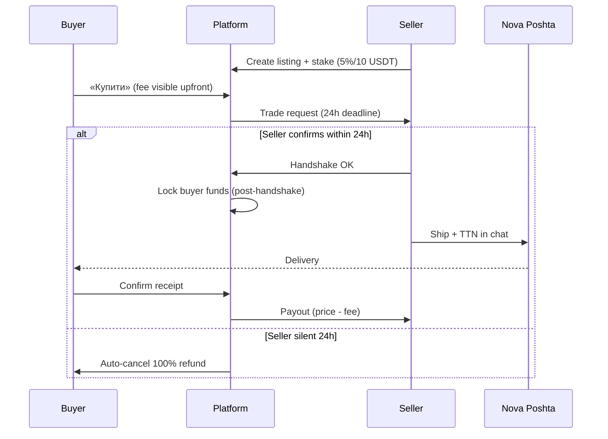
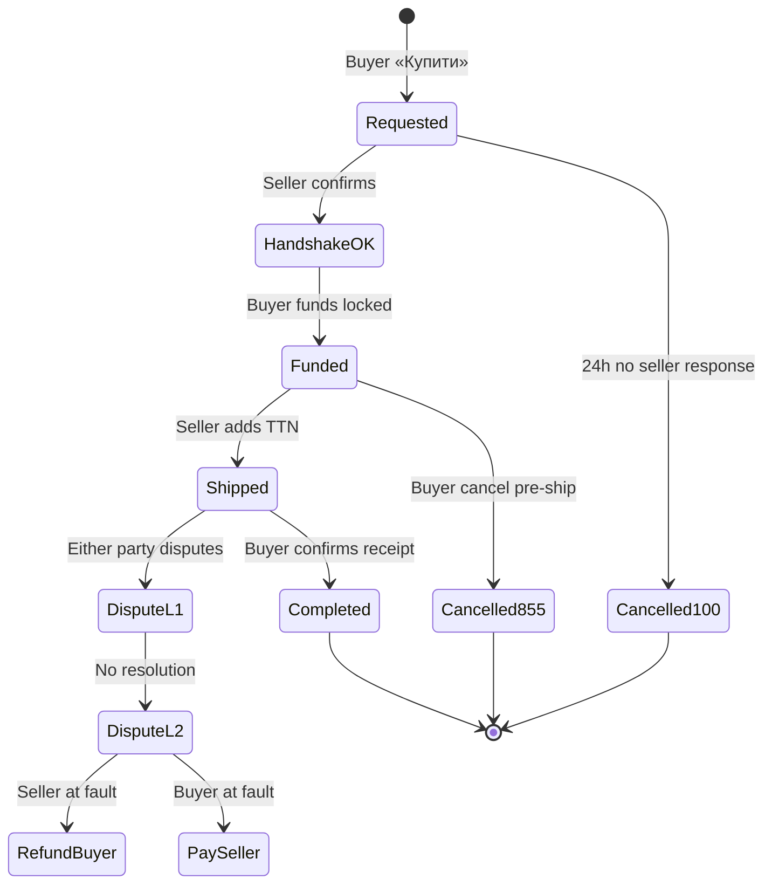
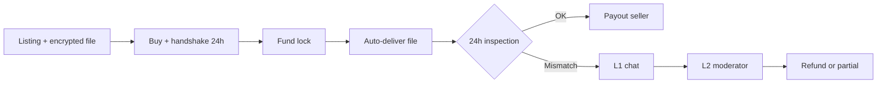
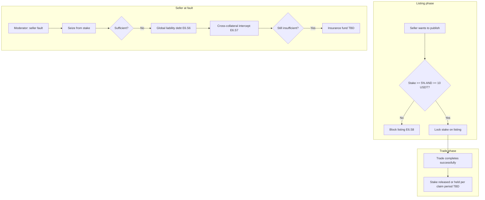
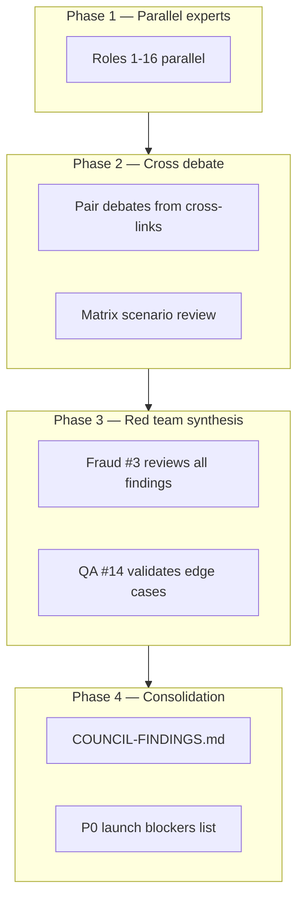

# Council Briefing — CryptoMarket P2P Product Review

**Версія:** 2026-05-23  
**Проєкт:** `cryptomarket-p2p`  
**Корінь репозиторію:** `/Volumes/workspace-drive/projects/other/cryptomarket-p2p`  
**Призначення:** Контекст для multi-agent expert council (Codex subagents). Агенти **не мають** доступу до чату власника — цей документ є єдиним джерелом правди для аналізу.  
**Очікуваний вихід council:** `_bmad-output/planning-artifacts/COUNCIL-FINDINGS.md`

> **Historical input artifact.** This briefing intentionally preserves pre-audit TBDs and older assumptions that were given to the council. Current implementation source of truth is `AUDIT-REPORT.md`, `DECISION-LOG.md`, `USER-PRODUCT-CONTRACT.md`, `traceability-matrix.md`, and `scripts/story-manifest.mjs`.

---

## 1. Executive summary

### 1.1 Що таке продукт

**CryptoMarket P2P** — децентралізований маркетплейс товарів на Internet Computer (ICP), орієнтований на **OLX-подібний UX**: користувач бачить оголошення → натискає **«Купити»** → **платформа веде угоду** (без полювання за адресою гаманця продавця в чаті). Розрахунок — **USDT/USDC** у підтримуваних мережах. Авторизація — **Internet Identity** (псевдоанонімні профілі).

**Цільовий UX:**
- Комісія платформи видна **на першому екрані до підтвердження**
- Особистий зовнішній гаманець користувача через підписаний nonce, можливо кілька гаманців
- Кошти продавця **не залишаються на платформі назавжди** — лише тимчасове блокування в рамках угоди та listing stake
- Фізичні товари: **лише Nova Poshta** (самовивіз/зустріч — out of scope)
- Цифрові товари: **лише файли** (ключі/текст/доступи — later), auto-delivery + 24h inspection

**Стратегічна мета (довгострокова):** trustless settlement на всіх обіцяних мережах; HTLC-style гарантії; community jury якщо модерація не масштабується.

**Phase 1.5 реальність (найближчий product slice):** OLX loop + platform rules + **частково** on-chain (ckUSDC/ckUSDT після handshake) + **manual** settlement для TRC20/BEP20/ERC20; seller stake; penalty splits; Nova Poshta UI unlock.

### 1.2 Що було вирішено СЬОГОДНІ (2026-05-23, owner alignment session)

Сесія вирівнювання UX → затверджений **[USER-PRODUCT-CONTRACT.md](./USER-PRODUCT-CONTRACT.md)** як **canonical user promises**. Course correction синхронізував PRD, epics, gap-analysis:

| Рішення | Було (старий PRD/epics) | Стало (контракт) |
|---------|-------------------------|------------------|
| Primary journey | Self-pickup MVP | **Nova Poshta only** |
| Buy flow | Manual wallet hunt, trade starts immediately | **«Купити» → seller 24h handshake → lock after confirm** |
| Fund lock timing | Early in flow / at trade start | **Після підтвердження продавцем** |
| Seller stake | Juror stake only | **5% від ціни, min 10 USDT** на listing |
| Buyer cancel pre-ship | Generic refund | **85% buyer / 10% seller / 5% platform** |
| Digital goods | Broader | **Files only** + 24h inspection |
| Disputes | Jury emphasis | **L1 chat → L2 moderator**; jury **deferred** |
| Settlement wording | HTLC near-term | **Phase 1.5:** ckUSDC/ckUSDT on-chain + manual multi-chain |

Деталі: [COURSE-CORRECTION.md](./COURSE-CORRECTION.md).

### 1.3 Явно OUT OF SCOPE (зараз)

| Не входить | Коментар |
|------------|----------|
| Самовивіз / зустріч (self-pickup, meetup) | Лише Nova Poshta для фізичних |
| Цифрові: ключі, текст, ліцензійні рядки, доступи | Лише завантажені файли |
| Jury / juror dashboard | Level 2 = модератор / third party |
| Trustless на всіх мережах | Довгострокова мета; не обіцяємо зараз |
| Ukrposhta, Meest (product) | Backend є; product-deferred |
| Custodial fiat, card, bank transfer | Stablecoin-only |
| Buyer stake при fraud | Phase 2+ (TBD) |
| Повна custodial модель | Гроші не «живуть» на платформі назавжди |

### 1.4 Strategic goal vs Phase 1.5 reality — ключова напруга

```
Стратегія:  OLX commerce + progressive decentralization → trustless all networks
Phase 1.5:   Platform-coordinated + partial on-chain (ck*) + manual multi-chain
Phase 1 код: Legacy flow БЕЗ handshake, БЕЗ stake UX, pickup lock, early payment
```

**North star (одне речення):**
> Phase 1.5: OLX-style crypto goods market where the platform leads the deal — fee upfront, seller confirms in 24h, funds lock after handshake, Nova Poshta or auto-delivered files, seller stake protects buyers.

Council має оцінити: чи Phase 1.5 plan **достатньо закритий** для launch promises; де залишаються «дірки» між контрактом і кодом; які ризики fraud/economics не покриті.

---

## 2. Locked product decisions (numbers + rules)

**Джерело правди для користувацьких обіцянок:** [USER-PRODUCT-CONTRACT.md](./USER-PRODUCT-CONTRACT.md) §3, §6.

| # | Параметр | Значення | Примітка / правило |
|---|----------|----------|-------------------|
| D1 | **Seller listing stake** | **5%** від ціни оголошення | Затверджено «for start» |
| D2 | **Min stake floor** | **10 USDT** | Навіть якщо 5% < 10 USDT |
| D3 | **Seller handshake window** | **24 години** | Після «Купити» |
| D4 | **Auto-cancel (no seller response)** | Buyer **100%** refund | Stake не списується за цей сценарій |
| D5 | **Fund lock timing** | **Після** seller confirm handshake | До handshake — кошти buyer **не заблоковані** |
| D6 | **Buyer cancel before shipment** | **85%** buyer / **10%** seller / **5%** platform | Від заблокованої суми |
| D7 | **Digital inspection window** | **24 години** | Після auto-delivery файлу |
| D8 | **Physical delivery** | **Nova Poshta only** | TTN/tracking у trade chat |
| D9 | **Digital goods (start)** | **Files only** | Encrypted upload на платформу |
| D10 | **Dispute L1** | Buyer ↔ Seller chat | Обов'язковий перший крок після shipment |
| D11 | **Dispute L2** | Moderator / third party | Jury **deferred** |
| D12 | **Seller at fault** | Full buyer refund | Charge з stake + global liability + insurance fund (last resort) |
| D13 | **Buyer at fault** | Refund denied / partial | Stake buyer — **Phase 2+ TBD** |
| D14 | **Start tokens** | USDT, USDC | 2–3 популярні мережі (exact TBD) |
| D15 | **Phase 1.5 on-chain** | ckUSDC, ckUSDT | ICRC-2 lock **after handshake** |
| D16 | **Phase 1.5 manual** | TRC20, BEP20, ERC20 | Coordinated confirmation |
| D17 | **Platform fee %** | **TBD** | Показується upfront; monetization не зафіксовано |
| D18 | **Insurance fund** | From platform fees | Пороги виплат — TBD (ref. `crypto_market`) |
| D19 | **Wallets** | external wallet signed-nonce proof, multi-wallet | E4.S7 backlog |
| D20 | **Auth** | Internet Identity only | Anonymous blocked on writes |

### Таблиця сценаріїв (хто виграє / хто втрачає)

| ID | Сценарій | Buyer | Seller | Platform |
|----|----------|-------|--------|----------|
| R1 | Успішна угода | Товар/файл; сплачена ціна + fee | Ціна − fee; stake за liability rules | Fee з угоди |
| R2 | Seller silent 24h | **100%** refund | Cancel; no stake penalty | No buyer penalty |
| R3 | Buyer cancel pre-shipment | **85%** | **10%** compensation | **5%** |
| R4 | Seller at fault | Full refund | Stake seizure + global liability | Insurance fund last resort |
| R5 | Buyer at fault | Denied/partial (moderator) | Paid + possible compensation | Fee + penalty TBD |
| R6 | Dispute post-shipment | L1 → L2; funds frozen | Same | Moderation |
| R7 | Digital inspection fail | Refund if proven mismatch | Paid after success or moderator | On request |
| R8 | Cancel in allowed windows | Per R2/R3/R6 | Per table | Per table |

---

## 3. End-to-end flows (narrative + mermaid)

### 3.1 Фізичний товар — happy path (Nova Poshta)

**Актори:** Buyer (Марія), Seller (Олег), Platform, Nova Poshta API

1. Олег створює listing (фото, ціна USDT/USDC, Nova Poshta). Блокує **stake 5% / min 10 USDT** (E6.S8 — planned).
2. Марія відкриває listing → бачить **price + platform fee + network + delivery** → «Купити» (E3.S8 — planned).
3. Platform створює trade request; Олег має **24h** на confirm/decline (E3.S7 — planned).
4. Олег підтверджує → **buyer funds lock** (E3.S10 + E9.S2: ckUSDC/ckUSDT on-chain або manual confirm).
5. Олег відправляє NP, додає TTN у trade chat (E7.S3 — backend ready, UI locked).
6. Марія підтверджує отримання (UX **TBD** — scan TTN, tracking API, manual).
7. Platform виплачує Олегу (price − fee); stake повертається або утримується per liability.



### 3.2 Фізичний товар — failure paths

#### FP-A: Seller silent (24h timeout)
- **Trigger:** Timer fires, no seller action
- **Outcome:** Auto-cancel; buyer **100%**; no seller stake penalty (R2)
- **Gap:** Потрібен E3.S7; поточний код — trade starts без handshake gate

#### FP-B: Buyer cancel before shipment
- **Trigger:** Buyer initiates cancel after lock, before seller ships
- **Outcome:** **85/10/5** split (R3)
- **Gap:** E3.S9; generic cancel/refund зараз без split

#### FP-C: Seller confirms, ships, buyer claims non-receipt
- **Trigger:** TTN shows delivered OR seller proves ship; buyer disputes
- **Flow:** L1 negotiation → L2 moderator; funds **frozen** until resolution
- **Open:** NP receipt confirmation UX — хто тригерить «delivered»? Buyer confirm vs tracking webhook vs timeout auto-complete?

#### FP-D: Seller at fault (no ship, fake item, wrong item)
- **Outcome:** Full buyer refund; seller stake seizure; global liability; insurance fund if insufficient
- **Partial today:** E6.S6 global liability gates; E6.S7 cross-collateral restrictions; **no** insurance fund; stake seizure on-chain deferred Gate C

#### FP-E: Dispute after shipment — seller wins
- Moderator rules buyer at fault → seller paid; buyer penalty mechanism **TBD Phase 2+**



### 3.3 Цифровий товар — happy path + inspection/refund

1. Seller створює digital listing, завантажує **encrypted file** на platform (E2.S11 — backlog).
2. Buyer «Купити» → seller **24h handshake** → lock → **auto-delivery** (seller offline OK).
3. **24h inspection window** opens (E7.S2 backend exists).
4. Success → seller paid. Fail → negotiation → L2 moderator.



**Abuse vectors for council:** buyer downloads → claims refund within 24h; re-download abuse; file forwarding; encryption key rotation.

### 3.4 Seller stake lifecycle



### 3.5 Cross-collateral / liability (old `crypto_market` + planned new)

**Reference repo:** `/Volumes/workspace-drive/projects/other/crypto_market`  
**Migration doc:** `docs/bmad/MIGRATION-FROM-CRYPTO_MARKET.md`

| Concept | Old `crypto_market` | New `cryptomarket-p2p` status |
|---------|---------------------|-------------------------------|
| **Global liability** | Debt tracked per Principal ID across roles/sessions (Story 6.2) | **Done** — E6.S6 `isTradeBlocked`, trade/listing gates |
| **Cross-collateral seizure** | Intercept **new** deposit to pay **old** debts (Story 6.3, Atomic Swap canister) | **Partial** — E6.S7 account restrictions Phase 1; ICRC seizure Gate C |
| **Insurance fund** | Platform reserve from tx fees; compensates when enforcement fails | **Not implemented** — design TBD Phase 2 |
| **HTLC** | Core MVP escrow (Hash/Time locks, preimage) | **Phase 3 roadmap** — not current promise |
| **Digital delivery** | Broader | Files only + encryption module in escrow |

Old project PRD §4.6:
- Cross-collateral: freeze/seize from **any active trade** to satisfy debt in **another trade**
- Global liability: persists at Principal level
- Insurance fund: funded by **transaction fees**, last-resort victim compensation

**Critical council question:** Phase 1.5 manual path — canister **does not hold buyer funds**. How do cross-collateral and insurance fund work without custodial seizure? Current answer: **account restrictions** until debt cleared; on-chain seizure when Gate C ships.

---

## 4. Current implementation state (honest snapshot)

**Date:** 2026-05-23 post course correction. Source: [gap-analysis.md](./gap-analysis.md).

### 4.1 Що ІСНУЄ в коді (aligned or shipped)

| Area | Status | Notes |
|------|--------|-------|
| OLX skeleton | ✅ | Listings, search, detail, create, trades, profiles |
| Stablecoin-only UI | ✅ | 4 tokens on home/create |
| Trade state machine | ✅ | **Legacy** — no handshake gate |
| Per-trade chat | ✅ | XSS-safe |
| Disputes + moderator | ✅ | Jury UI built-deferred |
| Reputation | ✅ | Dual buyer/seller scores |
| Global liability gates | ✅ | E6.S6 |
| Cross-collateral restrictions | ✅ | E6.S7 Phase 1 (no custodial seizure) |
| Nova Poshta backend | ✅ | Tracking timeline E7.S5 |
| Digital encryption + inspection module | ✅ | Backend; no auto-delivery post-handshake |
| Explorer verification | ✅ | E4.S2 backend + unit tests |
| ckUSDC/ckUSDT escrow backend | ✅ Partial | `escrow-api.mo`, Gate C not complete |
| Caffeine deploy + smoke/flows | ✅ | Live path exists |
| Honest payment copy | ✅ | `/how-payments-work` |

### 4.2 Що ЛИШЕ ЗАПЛАНОВАНО (Phase 1.5 backlog — P0)

| Gap | Story | Built? |
|-----|-------|--------|
| Seller handshake 24h + auto-cancel 100% | **E3.S7** | ❌ |
| Upfront fee breakdown on buy screen | **E3.S8** | ❌ |
| Buyer cancel pre-ship 10/5/85 | **E3.S9** | ❌ |
| Fund lock **after** handshake | **E3.S10** + E9.S2 | Partial backend |
| Seller stake 5% min 10 USDT | **E6.S8** | ❌ |
| Nova Poshta UI unlock | **E7.S3** | Backend only; `deliveryPolicy.ts` pickup lock |
| Digital file upload + auto-delivery | **E2.S11** | Partial |
| External wallet nonce-proof linking | **E4.S7** | ❌ |

### 4.3 Settlement nuance (Gate C)

Per `docs/bmad/ONCHAIN-SETTLEMENT-DESIGN.md`:
- **Phase 1 manual:** TRC20/BEP20/ERC20 — wallet-to-wallet; canister records state only
- **ckUSDC/ckUSDT:** backend supports `initiateOnChainTrade` + ICRC-2 escrow
- **Gate C incomplete:** testnet E2E, mainnet beta cap, security review, marketing wording
- **Feature flag:** `trustlessEscrowEnabled` — frontend must not expose on-chain CTA when false
- **Misalignment:** E9 spike locks at trade start; contract requires **post-handshake** lock (E3.S10)

### 4.4 Deferred explicitly

- E7.S1 self-pickup — product-deferred (code lock remains)
- E6.S4 jury dashboard — built-deferred
- E7.S4 Ukrposhta/Meest — product-deferred
- E10 governance/vault — built-deferred
- Insurance fund — no implementation

**Implementation priority (from course correction):**
1. E3.S7 → 2. E3.S8/E2.S11 → 3. E6.S8 → 4. E7.S3 → 5. E3.S10

---

## 5. Open TBDs requiring council analysis

Council **must** produce recommendations (not just list) for each:

| # | TBD | Why it matters | Questions for council |
|---|-----|----------------|----------------------|
| T1 | **Platform fee %** | Upfront display promised; affects penalty 5% slice economics | Sustainable %? Interaction with 10/5/85? Insurance fund accrual rate? |
| T2 | **Nova Poshta receipt confirmation UX** | Defines when trade completes; fraud surface | Buyer manual confirm vs TTN webhook vs auto-complete timeout? Gaming by buyer/seller? |
| T3 | **Insurance fund thresholds** | Last-resort buyer protection when stake insufficient | Min fund size? Max payout per incident? Solvency model? Ref. `crypto_market` epic-6-ideas |
| T4 | **First 2–3 chains for manual Phase 1.5** | User promise "2-3 networks" | TRC20+BEP20+ERC20 all? Priority by UA user base? |
| T5 | **Buyer fraud / penalty edge cases** | R5 says buyer at fault but no buyer stake Phase 1.5 | How to penalize without buyer stake? Reputation-only sufficient? |
| T6 | **Digital file DRM, encryption, re-download abuse** | 24h inspection + auto-delivery | One-time download link? Watermarking? Can buyer clone file and still refund? |
| T7 | **External wallet proof edge cases** | E4.S7 | Wrong wallet paid? Multi-wallet liability mapping? II principal vs external wallet identity |
| T8 | **Stake sufficiency on high-value items** | 5%/10 USDT on 5000 USDT item = 250 USDT stake — but min floor caps small items | Is 5% enough for 50 USDT item (stake=10)? For 10000 USDT item? |
| T9 | **Handshake before lock — manual path** | Buyer not locked pre-handshake — how prevent fake "paid" claims? | Payment intent vs actual transfer timing on manual chains |
| T10 | **Cross-collateral without custody Phase 1.5** | Restrictions vs actual fund recovery | Is account blocking enough deterrent? |
| T11 | **Moderator workload / SLA** | L2 is human bottleneck | Queue depth? Evidence standards? |
| T12 | **Claim period after successful trade** | Stake release timing | Window for post-completion disputes? |

---

## 6. Expert council roles — THE CORE

**Instructions for each subagent:**
- Read sections 1–5 of this document fully
- Answer **all** mandatory questions for your role
- Produce deliverable in specified format
- Explicitly **debate** cross-linked roles (agree/disagree + evidence)
- Flag **P0/P1/P2** severity on each finding
- Cite story IDs (E3.S7, etc.) and file paths where relevant
- Ukrainian prose; English OK for technical terms

---

### Role 1: P2P Marketplace Product Strategist / Стратег P2P-маркетплейсу

**Scope:** OLX/competitor patterns, user trust, product-market fit for UA crypto goods commerce, journey coherence.

**Mandatory questions:**
1. Чи Phase 1.5 scope достатній для credible OLX-like launch, чи потрібен scope cut?
2. Які competitor patterns (Binance P2P, LocalCryptos, OLX) ми повторюємо/пропускаємо?
3. Чи handshake 24h + post-lock не занадто складно для casual buyer vs trader?
4. Nova Poshta only — чи це deal-breaker для сегментів (локальні угоди, великогабарит)?
5. Чи upfront fee disclosure достатній для trust без escrow label?
6. Який minimum viable reputation signal до seller stake enforcement?
7. Чи deferred jury створює reputational risk при scale disputes?
8. Як positioning «coordinated → trustless» впливає на conversion?

**Deliverable format:**
```markdown
## Product Strategist Findings
### Strengths (max 5)
### Gaps vs OLX promise (table: gap | severity | recommendation)
### Journey friction points (ranked)
### Debates with: [roles]
### P0 actions before launch
```

**Cross-links:** UX & Transparency (#9), Economics (#12), Fraud Red Team (#3), Migration Analyst (#15)

---

### Role 2: Payment & Escrow Architect / Архітектор платежів і escrow

**Scope:** Lock timing, refund paths, multi-chain manual vs ckUSDC/ckUSDT on-chain, state machine money transitions.

**Mandatory questions:**
1. Чи E3.S10 + E9.S2 design достатній для post-handshake lock on all paths?
2. Manual TRC20/BEP20/ERC20 — exact buyer steps after handshake? Who confirms payment?
3. ICRC-2 failure rollback — чи buyer може застрягти between handshake and lock?
4. Refund on auto-cancel 100% — on-chain vs manual path differences?
5. 10/5/85 split — atomic on-chain possible? Manual reconciliation risk?
6. Dispute freeze — блокується release на ck*; що на manual path?
7. Timeout `checkAndExpireTimeouts` interaction з handshake timer?
8. Чи потрібен separate payment intent state pre-lock?

**Deliverable:** State machine diagram (mermaid) + gap table vs USER-PRODUCT-CONTRACT + recommended story AC amendments.

**Cross-links:** Motoko Engineer (#10), Multi-chain Engineer (#11), QA Edge Case (#14), Fraud Red Team (#3)

---

### Role 3: Fraud & Abuse Red Team / Червона команда fraud

**Scope:** Collusion, fake listings, chargeback-like abuse, stake gaming, sybil, moderator bribery.

**Mandatory questions:**
1. Top 10 fraud scenarios ranked by expected loss × probability?
2. Colluding buyer+seller extracting platform/insurance — feasible how?
3. Fake Nova Poshta TTN / tracking manipulation?
4. Seller confirms handshake then ghosts — buyer locked funds duration?
5. Multi-account seller bypassing global liability?
6. Digital: download + refund within 24h — preventable?
7. Buyer cancel 85% — intentional lock-and-cancel harassment of seller?
8. Stake min 10 USDT — sybil cheap listings to spam/trust wash?

**Deliverable:** Attack catalog (scenario | preconditions | impact | current mitigation | recommended control | severity).

**Cross-links:** Seller Liability (#4), Digital Goods (#5), Logistics (#6), Insurance (#16), QA (#14)

---

### Role 4: Seller Liability & Collateral Expert / Експерт з liability продавця

**Scope:** Stake %, min floor, cross-collateral, debt recovery, alignment with old crypto_market Stories 6.2/6.3.

**Mandatory questions:**
1. 5% + 10 USDT min — formula for items 20 USDT vs 5000 USDT vs 50000 USDT?
2. When stake < buyer refund obligation — exact waterfall (stake → liability → cross-collateral → insurance)?
3. Cross-collateral on manual path without custody — enforceability?
4. Can seller withdraw stake while trades pending?
5. Multiple concurrent listings — one stake pool or per listing?
6. Negative reputation redirect to treasury (ONCHAIN design) — fair?
7. Debt persistence after II identity loss / new principal?
8. E6.S8 acceptance criteria gaps?

**Deliverable:** Waterfall diagram + numeric examples (3 trade values) + comparison table old vs new project.

**Cross-links:** Economics (#12), Insurance (#16), Motoko (#10), Migration (#15)

---

### Role 5: Digital Goods & Content Delivery / Цифрові товари

**Scope:** File hosting, encryption, inspection window, auto-delivery post-handshake, abuse.

**Mandatory questions:**
1. E2.S11 + E7.S2 integration gaps for contract journey?
2. Encryption at rest — key management, who decrypts for buyer?
3. 24h inspection — clock start trigger (download vs delivery record)?
4. Re-download limits during/after inspection?
5. File hash commitment vs description mismatch disputes — evidence standard?
6. Platform storage liability (DMCA, illegal content)?
7. Large file limits / cost model on Caffeine blob?
8. Seller replaces file after handshake — prevented?

**Deliverable:** Digital flow sequence + abuse matrix + recommended AC for E2.S11.

**Cross-links:** Security (#13), Fraud (#3), Payment Architect (#2), QA (#14)

---

### Role 6: Logistics (Nova Poshta) Specialist / Логістика Nova Poshta

**Scope:** Proof of delivery, TTN validation, buyer confirm gaming, E7.S3 unlock.

**Mandatory questions:**
1. E7.S3 AC sufficient for contract «only NP»?
2. TTN creation — seller-only or platform-assisted API?
3. Tracking webhook (E7.S5) vs buyer manual confirm — recommended completion trigger?
4. Buyer refuses confirm despite delivered — timeout auto-release to seller?
5. Seller ships empty box with valid TTN — evidence for moderator?
6. `deliveryPolicy.ts` pickup lock removal risks?
7. NP API failure mid-trade — state?
8. International NP edge cases — in scope?

**Deliverable:** NP completion decision tree + TBD recommendation for USER-PRODUCT-CONTRACT §8.

**Cross-links:** Fraud (#3), UX (#9), Dispute (#7), Product Strategist (#1)

---

### Role 7: Dispute Resolution & Moderation / Спори та модерація

**Scope:** L1/L2 flows, evidence, frozen funds, moderator powers, jury deferral.

**Mandatory questions:**
1. L1 mandatory period before L2 — duration? Enforced in state machine?
2. Evidence types accepted (photos, NP scan, file hash, chat)?
3. Fund freeze scope — buyer locked amount only or seller stake too?
4. Moderator partial refund rules — allowed splits?
5. SLA target vs PRD ≤5% dispute rate?
6. Appeal path after L2?
7. Jury deferred — at what dispute volume must we enable E6.S4?
8. Buyer at fault without buyer stake — moderator tools?

**Deliverable:** Dispute playbook outline + state machine gaps + moderator checklist draft.

**Cross-links:** Regulatory (#8), Fraud (#3), Payment (#2), UX (#9)

---

### Role 8: Regulatory / Compliance (UA + crypto) / Регуляторика

**Scope:** High-level only — **not legal advice**. UA marketplace, crypto payments, pseudonymity, KYC tiers.

**Mandatory questions:**
1. P2P goods + stablecoin — high-level regulatory exposure UA (informational)?
2. Pseudonymous II — sufficient for dispute enforcement?
3. Optional KYC tiers (E12.S2) — when required for launch vs later?
4. Platform fee + insurance fund — money transmitter analogies (informational)?
5. Digital goods file hosting — content liability?
6. Nova Poshta personal data in chat — GDPR-style gaps (PRD notes not implemented)?
7. Tax reporting burden on users — UX disclosure needed?
8. What must **not** be promised in marketing copy?

**Deliverable:** Risk register (risk | likelihood | impact | mitigation direction | needs legal counsel Y/N).

**Cross-links:** UX (#9), Digital Goods (#5), Product Strategist (#1)

---

### Role 9: UX & Transparency / UX та прозорість

**Scope:** Upfront fees, warnings, seller debt visibility, honest Phase 1.5 copy, mobile web.

**Mandatory questions:**
1. E3.S8 fee breakdown — minimum fields and visual hierarchy?
2. Handshake countdown UX for seller and buyer?
3. When show «funds not locked yet» vs «locked» — prevent confusion?
4. Seller global liability / debt — show to buyer pre-trade?
5. `/how-payments-work` updates needed for handshake-before-lock?
6. Digital inspection countdown — buyer UX?
7. Error states: ICRC-2 fail, NP API fail, stake insufficient?
8. Ukrainian copy for 10/5/85 cancel — plain language?

**Deliverable:** Wireframe notes (text) for 3 critical screens + copy gaps list.

**Cross-links:** Product Strategist (#1), Payment (#2), Regulatory (#8)

---

### Role 10: Motoko/ICP Backend Engineer / Backend ICP

**Scope:** Canister feasibility of E3.S7–S10, E6.S8, E7.S3, E9.S2; Escrow.mo, timers, persistence.

**Mandatory questions:**
1. Handshake 24h timer — `checkAndExpireTimeouts` extension or new job?
2. Post-handshake lock — refactor `initiateTrade` vs new state?
3. 10/5/85 — Motoko fixed-point math, rounding, dust?
4. Seller stake lock — new map vs extend Escrow?
5. Reentrancy on ICRC-2 + dispute freeze interaction?
6. Orthogonal persistence — timer survival across upgrades?
7. Rate limits on handshake spam?
8. E6.S7 seizure Gate C — code paths ready?

**Deliverable:** Implementation risk table per story + suggested module ownership + test gaps.

**Cross-links:** Payment (#2), Security (#13), QA (#14), Multi-chain (#11)

---

### Role 11: Multi-chain / Wallet Engineer / Multi-chain гаманці

**Scope:** External wallet nonce-proof E4.S7, TRC20/BEP20/ERC20 manual, ckUSDC/ckUSDT trustless roadmap.

**Mandatory questions:**
1. First 2–3 chains recommendation with rationale (UA users)?
2. External wallet proof + II — identity binding model?
3. Wrong-chain payment — detection and recovery?
4. Manual confirm — explorer verify (E4.S2) enough post-handshake?
5. ckUSDC vs ckUSDT — both required Day 1 Gate C?
6. Multi-wallet — which wallet receives seller payout?
7. USDC ERC20 vs USDT TRC20 price/display — oracle edge cases?
8. Roadmap trustless — per-chain priority order?

**Deliverable:** Chain rollout matrix + wallet linking spec sketch + manual vs on-chain decision tree.

**Cross-links:** Payment (#2), Security (#13), UX (#9), Economics (#12)

---

### Role 12: Economics & Fee Model / Економіка та комісії

**Scope:** Platform fee %, penalty splits sustainability, insurance fund accrual, treasury (E10 deferred).

**Mandatory questions:**
1. Recommended platform fee % range with sensitivity analysis?
2. 10/5/85 — does 5% platform slice cover ops + insurance accrual?
3. Insurance fund — % of fee to reserve, min solvency threshold?
4. Seller stake 5% — opportunity cost vs listing volume?
5. Penalty 10% to seller on buyer cancel — enough compensation for NP prep costs?
6. Race to bottom on fees vs trust investment?
7. E10 treasury deferred — manual fee collection tracking gap?
8. Negative margin scenarios (small trades, min stake 10 USDT on 50 USDT item)?

**Deliverable:** Simple economic model (assumptions table + 3 scenarios) + fee recommendation.

**Cross-links:** Insurance (#16), Seller Liability (#4), Product (#1), Fraud (#3)

---

### Role 13: Security Engineer / Безпека

**Scope:** Key management, platform file storage, encryption, admin keys, escrow-api.mo review.

**Mandatory questions:**
1. Encrypted digital files — key lifecycle and breach impact?
2. Admin `trustlessEscrowEnabled` toggle — abuse surface?
3. Explorer API keys (E4.S4) — leakage risk?
4. Chat XSS — sufficient for trade evidence integrity?
5. Rate limiting — handshake/trade spam DoS?
6. ICRC-2 approve phishing — user education?
7. Blob storage certified data hook — tampering?
8. Gate C security review scope — top 5 code areas?

**Deliverable:** Threat model (STRIDE-lite) + prioritized security backlog.

**Cross-links:** Motoko (#10), Digital Goods (#5), Multi-chain (#11), QA (#14)

---

### Role 14: QA / Edge Case Hunter / QA та крайні випадки

**Scope:** State machine holes, race conditions, timeout edges, concurrent trades.

**Mandatory questions:**
1. Seller confirms handshake same second as 24h timeout — winner?
2. Buyer cancel pre-ship while seller marking shipped?
3. Two buyers one listing — concurrency?
4. Dispute opened during ICRC-2 transfer_from?
5. Stake seized while listing active for another buyer?
6. Digital inspection expires during L1 dispute?
7. Manual payment marked sent before handshake (legacy path) — migration?
8. Clock skew / timer ordering across canister upgrades?

**Deliverable:** Edge case catalog (min 25 rows) mapped to test types (unit/integration/E2E).

**Cross-links:** Motoko (#10), Payment (#2), Fraud (#3), Logistics (#6)

---

### Role 15: Migration Analyst (crypto_market) / Аналітик міграції

**Scope:** What old project solved that new might miss; HTLC, liability, insurance, dispute patterns.

**Mandatory questions:**
1. Story 6.2/6.3 — full behavior parity in new repo?
2. HTLC lessons (e.g. secretHash from buyer) — applicable Phase 3?
3. Insurance fund epic-6-ideas — what to port?
4. Old Flutter multi-canister vs monolith — lost capabilities?
5. Old PRD payment methods excluded — any trust pattern lost?
6. DAO jury — defer correct given old emphasis?
7. Old audit findings (AUDIT_REPORT) — still relevant?
8. Digital delivery breadth reduction — risk?

**Deliverable:** Migration parity matrix (old feature | new status | risk if missing | action).

**Cross-links:** Seller Liability (#4), Insurance (#16), Payment (#2), Dispute (#7)

---

### Role 16: Insurance / Risk Pool Designer / Страховий пул

**Scope:** When seller stake insufficient; fund governance; solvency; payout caps.

**Mandatory questions:**
1. Trigger conditions for insurance payout vs deny?
2. Max payout per trade / per day / global?
3. Funding: % platform fee vs separate premium?
4. Collusion fraud against fund — detection?
5. Fund empty — then what (buyer takes loss?) — contradicts R4 promise?
6. Relationship to E10 vault (deferred) — merge or separate?
7. Transparency: public fund balance?
8. Phase 2 timing — can launch Phase 1.5 without fund?

**Deliverable:** Insurance fund policy draft (parameters TBD marked) + launch blocker assessment.

**Cross-links:** Economics (#12), Seller Liability (#4), Fraud (#3), Regulatory (#8)

---

## 7. Cross-cutting analysis matrix

**Legend:** ● = must weigh in | ○ = optional consult

| Scenario | 1 Strat | 2 Pay | 3 Fraud | 4 Liab | 5 Digital | 6 NP | 7 Disp | 8 Reg | 9 UX | 10 Motoko | 11 Chain | 12 Econ | 13 Sec | 14 QA | 15 Migr | 16 Ins |
|----------|---------|-------|---------|--------|-----------|------|--------|-------|-----|-----------|----------|---------|--------|-------|-------|--------|
| Seller silent 24h | ○ | ● | ● | ○ | ○ | ○ | ○ | ○ | ● | ● | ○ | ○ | ○ | ● | ○ | ○ |
| Buyer cancel 85/10/5 | ● | ● | ● | ○ | ○ | ○ | ○ | ○ | ● | ● | ● | ● | ○ | ● | ○ | ○ |
| Seller at fault refund | ● | ● | ● | ● | ○ | ● | ● | ○ | ● | ● | ● | ● | ○ | ● | ● | ● |
| Buyer fraud post-receipt | ● | ● | ● | ● | ○ | ● | ● | ○ | ● | ○ | ○ | ○ | ○ | ● | ○ | ○ |
| Collusion + insurance | ● | ● | ● | ● | ○ | ● | ● | ● | ○ | ○ | ○ | ● | ● | ● | ● | ● |
| Digital download + refund | ● | ● | ● | ○ | ● | ○ | ● | ○ | ● | ● | ○ | ○ | ● | ● | ○ | ○ |
| NP TTN fake / empty box | ● | ○ | ● | ○ | ○ | ● | ● | ○ | ● | ○ | ○ | ○ | ○ | ● | ○ | ○ |
| Stake insufficient high value | ● | ● | ● | ● | ○ | ○ | ● | ○ | ● | ● | ○ | ● | ○ | ● | ● | ● |
| Manual chain wrong payment | ○ | ● | ● | ○ | ○ | ○ | ● | ○ | ● | ● | ● | ○ | ● | ● | ○ | ○ |
| Handshake/lock race timeout | ○ | ● | ● | ○ | ○ | ○ | ○ | ○ | ● | ● | ○ | ○ | ○ | ● | ○ | ○ |
| Multi-account liability bypass | ● | ○ | ● | ● | ○ | ○ | ● | ● | ○ | ● | ○ | ○ | ● | ● | ● | ● |
| ckUSDC ICRC-2 fail rollback | ○ | ● | ○ | ○ | ○ | ○ | ○ | ○ | ● | ● | ● | ○ | ● | ● | ○ | ○ |
| Sybil cheap listings (10 USDT stake) | ● | ○ | ● | ● | ○ | ○ | ○ | ○ | ● | ● | ○ | ● | ○ | ● | ○ | ○ |
| Moderator backlog / SLA miss | ● | ○ | ● | ○ | ○ | ○ | ● | ○ | ● | ○ | ○ | ● | ○ | ○ | ● | ○ |
| Legacy flow vs Phase 1.5 migration | ● | ● | ○ | ● | ● | ● | ● | ○ | ● | ● | ● | ○ | ○ | ● | ● | ○ |

---

## 8. Known attack scenarios to stress-test

Council **must** evaluate each: detection, mitigation, residual risk, story coverage.

### Physical goods
1. Seller lists cheap item, buyer pays, seller never ships → expect auto-cancel **only pre-lock**; post-lock → dispute path
2. Seller never responds 24h → buyer 100% (R2) — verify no lock occurred
3. Buyer pays (manual), seller confirms handshake, buyer chargeback-like bank dispute off-platform — platform exposure?
4. Seller confirms, locks buyer funds, never ships NP → buyer refund + stake seizure
5. Seller ships, buyer claims non-receipt despite NP «delivered»
6. Seller ships empty box with valid TTN
7. Fake TTN entered — tracking shows invalid
8. Buyer confirms receipt then opens dispute (buyer fraud)
9. Buyer cancel pre-ship repeatedly to harass seller (85% still costs buyer 15%)
10. Seller uses stolen goods listing

### Collusion & platform extraction
11. Colluding buyer+seller fake disputes to extract insurance fund
12. Colluding pair: high value trade, seller at fault, stake minimal vs refund — drain fund
13. Buyer and seller same person (II sybil) — wash reputation
14. Seller creates many accounts to bypass global liability after debt
15. Moderator bribery — off-platform payment for favorable ruling

### Stake & economics
16. Stake min 10 USDT on 5000 USDT item — is 5% (250 USDT) enough deterrent?
17. Stake min 10 USDT on 50 USDT item — 20% effective stake — barrier to entry?
18. Seller lowers price after stake calc then raises in chat off-platform
19. Platform fee 0% assumption — insurance fund never funds
20. Buyer cancel 10/5/85 on low value trade — seller receives cents

### Digital goods
21. Buyer downloads file, claims refund within 24h inspection
22. Buyer shares file externally, still requests refund
23. Seller uploads malware — platform liability
24. Seller uploads placeholder file, description promises more
25. Re-download during inspection to reset timer (if allowed)
26. Encryption bypass / screen capture exfiltration

### Payments & wallets
27. Buyer sends wrong token/network after handshake
28. Buyer sends insufficient amount — partial lock acceptance?
29. External wallet proof/session hijack
30. Seller payout to wrong linked wallet
31. ckUSDC lock succeeds, manual path also paid — double pay confusion

### State machine & timing
32. Handshake timeout fires during seller confirm click
33. Dispute during auto-cancel job
34. Two concurrent trades depleting one stake pool
35. Canister upgrade mid-24h timer

---

## 9. Synthesis instructions for orchestrator (Codex)

### 9.1 Council execution model



**Step 1 — Spawn:** 16 subagents, one per §6 role. Each receives this full document path.

**Step 2 — Parallel analysis:** Each produces their §6 deliverable format. Max 800 words per role unless critical P0 findings.

**Step 3 — Debate rounds:** Orchestrator pairs cross-linked roles on disagreements (minimum 5 debate pairs):
- Fraud (#3) vs Insurance (#16) on collusion
- Payment (#2) vs Motoko (#10) on post-handshake lock
- Logistics (#6) vs UX (#9) on NP completion UX
- Economics (#12) vs Product (#1) on fee %
- Migration (#15) vs Seller Liability (#4) on cross-collateral parity

**Step 4 — Red team pass:** Fraud (#3) + QA (#14) adversarially challenge consolidated draft.

**Step 5 — Write** `_bmad-output/planning-artifacts/COUNCIL-FINDINGS.md`:

```markdown
# Council Findings — CryptoMarket P2P

## Executive verdict
- Launch readiness for Phase 1.5 promises: [RED/AMBER/GREEN]
- Top 5 P0 blockers
- Top 5 acceptable risks with mitigations

## Findings by domain
### Product & UX
### Payments & escrow
### Fraud & security
### Liability & insurance
### Digital & logistics
### Engineering feasibility

## Debate resolutions
| Topic | Position A | Position B | Resolution | Owner story |

## Attack scenario results
| # | Scenario | Verdict | Mitigation status | Gap |

## Open TBD decisions (recommended answers)
| TBD | Recommendation | Confidence | Needs owner sign-off |

## Story impact backlog
| Story | Recommended AC change | Priority |

## Dissenting opinions
(minority views preserved)

## Appendix: per-role submissions (links or summaries)
```

### 9.2 Quality gates for synthesis

- Every **P0** finding must map to ≥1 story ID or new story proposal
- Every **TBD** in §5 must have recommended default or explicit «owner must decide»
- No finding without severity + evidence reference (contract rule, code path, or attack logic)
- Preserve Ukrainian language in user-facing recommendations

### 9.3 What council must NOT do

- Implement code
- Give binding legal advice (Role 8 informational only)
- Expand scope beyond USER-PRODUCT-CONTRACT without flagging as «scope change proposal»
- Assume chat history — **only this document + cited repo files**

---

## 10. File index & pointers

### Canonical planning (read first)
| File | Purpose |
|------|---------|
| `_bmad-output/planning-artifacts/USER-PRODUCT-CONTRACT.md` | **User promises — source of truth** |
| `_bmad-output/planning-artifacts/COURSE-CORRECTION.md` | 2026-05-23 alignment summary |
| `_bmad-output/planning-artifacts/prd.md` | PRD v2026-05-23 |
| `_bmad-output/planning-artifacts/gap-analysis.md` | Three-way code vs contract gaps |
| `_bmad-output/planning-artifacts/epics.md` | Epic map + Phase 1.5 backlog |
| `_bmad-output/planning-artifacts/architecture.md` | Stack, settlement phases |
| `_bmad-output/planning-artifacts/COUNCIL-BRIEFING.md` | **This document** |
| `_bmad-output/planning-artifacts/COUNCIL-FINDINGS.md` | **Expected council output** |

### BMAD stories (Phase 1.5 priority)
| Story | Path |
|-------|------|
| E3.S7 handshake 24h | `_bmad-output/implementation-artifacts/stories/e03-trade/e03-s07-seller-handshake-24h.md` |
| E3.S8 upfront fee | `_bmad-output/implementation-artifacts/stories/e03-trade/e03-s08-upfront-fee-breakdown.md` |
| E3.S9 penalty 10/5/85 | `_bmad-output/implementation-artifacts/stories/e03-trade/e03-s09-buyer-cancel-penalty-split.md` |
| E3.S10 post-handshake lock | `_bmad-output/implementation-artifacts/stories/e03-trade/e03-s10-post-handshake-fund-lock.md` |
| E4.S7 External wallet proof | `_bmad-output/implementation-artifacts/stories/e04-payments/e04-s07-external-wallet-nonce-proof.md` |
| E6.S8 seller stake | `_bmad-output/implementation-artifacts/stories/e06-disputes/e06-s08-seller-listing-stake.md` |
| E2.S11 digital upload | `_bmad-output/implementation-artifacts/stories/e02-marketplace/e02-s11-digital-file-upload-auto-delivery.md` |
| E7.S3 Nova Poshta | `_bmad-output/implementation-artifacts/stories/e07-fulfillment/e07-s03-nova-poshta-e2e.md` |
| E9.S2 fund lock | `_bmad-output/implementation-artifacts/stories/e09-onchain-escrow/e09-s02-fund-lock-on-trade.md` |

### Technical design
| File | Purpose |
|------|---------|
| `docs/bmad/MIGRATION-FROM-CRYPTO_MARKET.md` | Old → new migration decisions |
| `docs/bmad/ONCHAIN-SETTLEMENT-DESIGN.md` | Gate C, ICRC-2, failure modes |
| `docs/bmad/ADR-ICRC-VS-EXTERNAL-WALLET.md` | Wallet model ADR |
| `docs/bmad/ADR-CROSS-CHAIN-PATTERN.md` | Cross-chain ADR |
| `src/frontend/src/lib/deliveryPolicy.ts` | Pickup lock (NP blocked in UI) |
| `src/backend/mixins/escrow-api.mo` | On-chain trade initiation |
| `src/backend/lib/Escrow.mo` | Trade state logic |

### Old project reference (read-only)
| Path | Relevant concepts |
|------|-------------------|
| `/Volumes/workspace-drive/projects/other/crypto_market/docs/prd/4-functional-requirements.md` | §4.6 Liability & Enforcement |
| `/Volumes/workspace-drive/projects/other/crypto_market/docs/stories/story-6-2-global-liability.md` | Global liability |
| `/Volumes/workspace-drive/projects/other/crypto_market/docs/stories/story-6-3-cross-collateral.md` | Cross-collateral seizure |
| `/Volumes/workspace-drive/projects/other/crypto_market/docs/handoff/epic-6-ideas.md` | Insurance fund ideas |
| `/Volumes/workspace-drive/projects/other/crypto_market/docs/prd/prd-compact.md` | HTLC vision, insurance |

### Manifest / tracking
| File | Purpose |
|------|---------|
| `scripts/story-manifest.mjs` | Story status source |
| `_bmad-output/implementation-artifacts/stories/index.md` | Story index |
| `_bmad-output/planning-artifacts/traceability-matrix.md` | FR ↔ stories |

---

## Appendix A: Glossary

| Term | Meaning |
|------|---------|
| Handshake | Seller confirm/decline within 24h after buyer «Купити» |
| Phase 1.5 | Next product slice per USER-PRODUCT-CONTRACT |
| Gate C | On-chain escrow public beta exit criteria |
| Cross-collateral | Seizing/intercepting user's new funds to cover old debt |
| Global liability | Per-principal debt state across trades |
| Inspection window | 24h digital goods verification period |
| Manual path | Off-chain wallet transfer with platform coordination |
| ckUSDC/ckUSDT | ICRC tokens on ICP for on-chain escrow |

---

## Appendix B: Council spawn prompt (copy for Codex)

```
You are expert role [N]: [Role Name] for CryptoMarket P2P council review.

Read fully:
/Volumes/workspace-drive/projects/other/cryptomarket-p2p/_bmad-output/planning-artifacts/COUNCIL-BRIEFING.md

Follow §6 role [N]: answer all mandatory questions, produce deliverable format, debate cross-linked roles.

Do not implement code. Output in Ukrainian (English for technical terms OK).
Severity: P0/P1/P2 on every finding.
```

---

*Document prepared 2026-05-23 for Codex multi-agent handoff. Source artifacts: USER-PRODUCT-CONTRACT, COURSE-CORRECTION, prd, gap-analysis, epics, MIGRATION-FROM-CRYPTO_MARKET, ONCHAIN-SETTLEMENT-DESIGN, crypto_market liability reference.*
