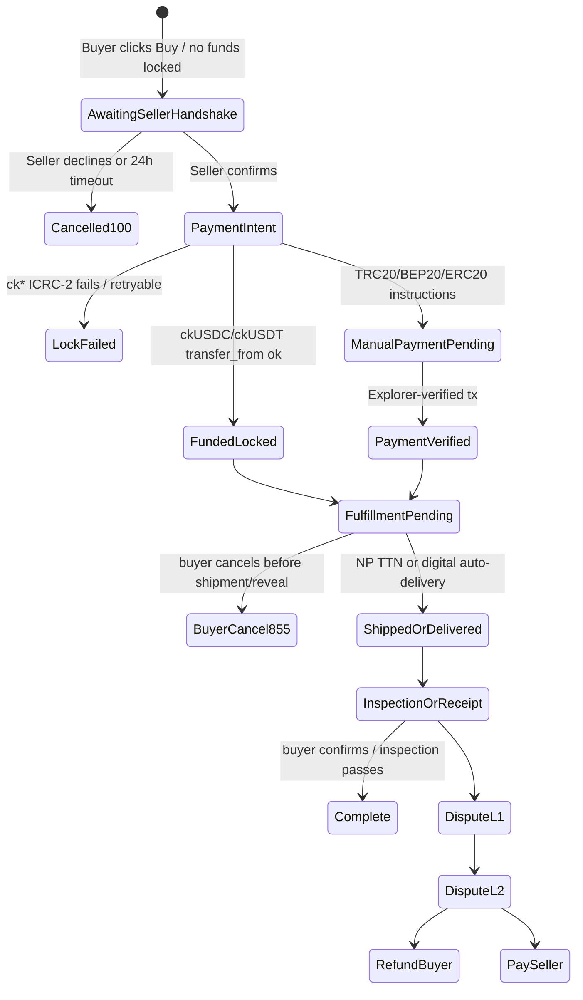

# Council Findings - CryptoMarket P2P

**Дата:** 2026-05-23  
**Input:** [`COUNCIL-BRIEFING.md`](./COUNCIL-BRIEFING.md)  
**Output:** multi-role product, fraud, escrow, UX, backend, security, QA, migration, compliance, and insurance council synthesis.  
**Scope:** Phase 1.5 launch readiness against [`USER-PRODUCT-CONTRACT.md`](./USER-PRODUCT-CONTRACT.md).  

> This is not legal advice. Regulatory/compliance notes are informational risk signals and require counsel before launch commitments.
>
> **Historical council output.** RED launch findings are preserved as the first-pass audit record. Documentation fixes and resolved TBDs are tracked in `AUDIT-REPORT.md`, `DECISION-LOG.md`, `USER-PRODUCT-CONTRACT.md`, `traceability-matrix.md`, and `scripts/story-manifest.mjs`.

## Executive verdict

**Launch readiness for Phase 1.5 promises: RED.**

The council agrees that the product direction is coherent and worth pursuing: an OLX-style goods marketplace where the platform leads the deal, not a chat-based wallet hunt. However, the current Phase 1.5 promise is not yet launch-ready because the code and story backlog do not enforce the core trust sequence:

```text
Buy request -> seller 24h handshake -> payment intent -> fund lock / verified payment -> fulfillment -> receipt / inspection -> payout or dispute
```

Today, the implementation still contains legacy paths where trades can start without seller handshake, on-chain lock can happen before seller confirmation, manual payment verification can be spoofed, Nova Poshta completion is undefined, seller listing stake is not enforced, and insurance/cross-collateral promises exceed actual recovery ability on manual chains.

### Top 5 P0 blockers

| # | Blocker | Evidence | Owner story |
|---|---|---|---|
| 1 | No enforced seller-handshake state before payment/lock. `initiateTrade` creates a legacy `#pending` trade with 72h refund timing, not a 24h seller response gate. | `src/backend/lib/Escrow.mo`, E3.S7, E3.S10 | E3.S7, E3.S10 |
| 2 | Payment state machine is unsafe: on-chain `initiateOnChainTrade` locks before handshake; manual `verifyTradePayment` can mark paid without real explorer validation. | `src/backend/mixins/escrow-api.mo`, `src/backend/mixins/payments-api.mo`, E9.S2 | E3.S10, E9.S2, E4.S7 |
| 3 | Seller listing stake and liability waterfall are not implemented as enforceable collateral. | E6.S8, `types.mo`, old `crypto_market` 6.2/6.3 comparison | E6.S8, E6.S6, E6.S7 |
| 4 | Nova Poshta physical completion UX/state is not defined and current project guidance still contains a self-pickup UI lock conflicting with the new contract. | E7.S3, `src/frontend/src/lib/deliveryPolicy.ts`, project `AGENTS.md` | E7.S3 |
| 5 | Insurance/full-refund wording is not supportable until a capped reserve policy and ledger exist. Manual chains cannot provide custodial seizure. | T3, T10, E10 deferred, old insurance reference | New insurance policy story / E10 |

### Top acceptable risks with mitigations

| Risk | Acceptable only if... | Priority |
|---|---|---|
| Manual TRC20/BEP20/ERC20 path is not trustless | Copy says "platform-coordinated manual settlement"; trade caps and explorer verification are enforced | P1 |
| Jury is deferred | L1/L2 moderator SLA, evidence checklist, appeal threshold, and jury trigger thresholds are published | P1 |
| Nova Poshta only narrows supply | Product is positioned as delivery-first crypto marketplace, not full OLX parity | P2 |
| Digital files can be copied after download | No DRM promise; evidence-based disputes, immutable file hash/version, low launch caps | P1 |
| Internet Identity is pseudonymous | High-value / repeat seller tiers add progressive verification, wallet binding, and risk checks | P1 |

## Findings by domain

### Product & UX

The council sees a strong north star but a sharp promise/code gap.

| Finding | Severity | Recommendation |
|---|---:|---|
| OLX-like "Купити" is credible only if the buyer is guided through a platform-owned flow, not a seller wallet hunt. | P0 | Make "Надіслати запит продавцю" the first CTA, not "Pay now"; expose countdown and lock status. |
| Upfront fee disclosure cannot remain TBD. | P0 | Pick a default platform fee before E3.S8 ships; suggested default is 3%, A/B range 2.5-4%. |
| Manual settlement must not look like escrow. | P1 | Use "coordinated payment protection" for TRC20/BEP20/ERC20; reserve "trustless escrow" for ck* after Gate C. |
| Seller trust signal is under-specified. | P1 | Buyer-facing trust block should include seller age, completed trades, dispute rate, active stake, and debt/liability flag. |

Critical UX copy defaults:

- Before seller confirms: "Ваші кошти ще не заблоковано."
- After lock: "Кошти заблоковано. Продавець може відправляти товар."
- Manual path: "Це ручне підтвердження переказу, не trustless escrow."
- Buyer cancel pre-ship: show exact 85/10/5 amounts before confirmation.
- ICRC failure: "Кошти не заблоковано. Продавець не має відправляти товар."

### Payments & escrow

Payment architecture is the central RED area.

Required target state machine:



P0 acceptance amendments:

- E3.S7: add `awaiting_seller_handshake`, 24h `sellerResponseDeadline`, idempotent seller confirm vs timeout handling, and no payment CTA before seller confirmation.
- E3.S10: create `PaymentIntent` after handshake with token, network, exact amount, recipient/escrow, expiry, and path `manual|ck`.
- E9.S2: change on-chain lock from `listingId` initiation to "seller-confirmed tradeId"; ICRC failure must roll back to payable state, not ghost-funded.
- E3.S9: buyer cancel pre-ship is a separate unilateral path after lock and before shipment/reveal; ck* split must be atomic with deterministic dust handling.
- E4.S7: manual "paid" state requires explorer verification of chain, token contract, from/to addresses, amount, decimals, and confirmations.

### Fraud & security

The top fraud spine is:

```text
manual settlement without custody + weak identity graph + future insurance promise
```

P0 security issues found:

| Area | Issue | Required control |
|---|---|---|
| Manual payment | `verifyTradePayment` can mark a trade paid without reliable explorer validation. | Disable/remove it; route all manual claims through verified tx matching. |
| Gate C | `trustlessEscrowEnabled` defaults true while Gate C is incomplete. | Default false; add beta caps, ledger allowlist, enable-delay or two-person admin. |
| Release path | Seller can release from funded state before fulfillment/receipt in current escrow logic. | Block seller release until shipped+receipt, digital inspection success/expiry, or moderator outcome. |
| Digital files | Deterministic XOR "encryption" and public plaintext file URLs are not acceptable for paid delivery. | Random per-trade DEK, encrypted blob, hash commitment, key reveal only after funding. |
| Object storage | Public cert/delete endpoints and weak binding can enable storage abuse. | Authenticated uploader/gateway binding, quotas, hash-to-listing/trade binding. |

### Liability & insurance

Seller stake formula is acceptable as a start but not enough for high-value protection.

```text
refund obligation P
-> seize seller listing stake S = max(5% * P, 10 USDT)
-> residual liability D = max(0, P - S)
-> cross-collateral recovery where custody exists
-> capped insurance / reserve
-> unpaid liability blocks account
```

Numeric examples:

| Trade price | Stake | Effective stake | Seller-fault residual before recovery |
|---:|---:|---:|---:|
| 20 USDT | 10 USDT | 50% | 10 USDT |
| 5,000 USDT | 250 USDT | 5% | 4,750 USDT |
| 50,000 USDT | 2,500 USDT | 5% | 47,500 USDT |

Insurance verdict:

- P0 blocker if marketed as full refund / guaranteed insurance.
- Acceptable beta path: no insurance guarantee, low trade caps, seller stake, liability gates, honest reserve copy, and no high-value coverage claims.
- Suggested beta cap: cover only trades up to 500 USDT, payout limited to the lower of unrecovered loss, 20% of liquid fund, and per-user/per-day caps.
- Suggested funding: 35-50% of platform fee to reserve until solvency target; do not use seized stake as normal reserve income.

### Digital & logistics

Digital goods:

- P0: no download URL/key before seller confirm and buyer funding.
- P0: immutable `fileVersionId`, ciphertext hash, size/MIME, and listing snapshot.
- P0: inspection clock starts at delivery record, not first download; redownload never resets timer.
- P0: seller replacement applies only to future trades.
- P0: malware/allowlist and illegal-content policy needed before broad launch.

Nova Poshta:

Recommended contract default:

> Physical trade completes after buyer confirmation or after NP tracking `delivered/вручено` plus 48h without dispute. `Arrived at branch` is not delivery. If NP API is unavailable or TTN invalid, no automatic completion occurs. Seller cannot unilaterally complete a physical trade.

P0 gaps:

- UI still locked to self-pickup per project `AGENTS.md` and `deliveryPolicy.ts`.
- E7.S3 AC does not cover completion trigger, auto-release, invalid TTN, API outage, empty-box evidence, or dispute freeze.
- Current release path appears seller-driven and conflicts with buyer-confirm/NP-delivered completion.

### Engineering feasibility

The backend can support the target flow, but it requires state-machine refactor, not just UI changes.

Suggested module ownership:

| Module | Responsibility |
|---|---|
| `Types.mo` | schema/versioning for handshake, payment intent, stake, shipping markers; use additive optional fields or side maps |
| `Escrow.mo` | pure sync state machine, fixed-point math, dust policy, terminal transitions |
| `escrow-api.mo` | async ICRC calls only, CallerGuard, ledger failure recovery, no duplicate business math |
| New `Stake.mo` / `stake-api.mo` | listing stake lock/release/seizure and publish gate |
| `shipping-api.mo` | NP-only fulfillment gates, TTN validation, tracking timeline |
| `admin-api.mo` / `Admin.mo` | fee bps config, Gate C flags, beta caps, emergency pause |

Backend P0s:

- Timer model is currently admin/manual scan; need persistent deadlines plus re-registered transient timer/job after upgrade.
- `processingTrades` should be transient or safely cleared; persistent stuck locks are dangerous.
- `initiateOnChainTrade` mutates before `await` and rollback decrements `nextTradeId`, unsafe under interleaving.
- Release/refund paths should not mark terminal before ledger transfer success.
- Tests are missing for handshake races, 85/10/5 dust, stake lifecycle, ICRC rollback, NP gates, and rate limits.

## Debate resolutions

| Topic | Position A | Position B | Resolution | Owner story |
|---|---|---|---|---|
| Fraud vs insurance on collusion | Insurance helps trust and conversion. | Insurance creates a drain target if sybil/collusion controls are weak. | Do not market insurance until capped reserve policy, dual approval, graph checks, and payout caps exist. Beta can launch without insurance promise. | New insurance policy / E10 |
| Payment vs Motoko on post-handshake lock | Product contract requires lock after seller confirm. | Current `initiateOnChainTrade` locks at trade start and rollback is unsafe. | Refactor to `PaymentIntent` on seller-confirmed `tradeId`; no payment/lock before handshake. | E3.S7, E3.S10, E9.S2 |
| Logistics vs UX on NP completion | NP delivered can auto-complete after timeout. | Buyer needs a clear confirm/dispute window and API outages must fail closed. | Buyer confirm or NP `delivered` + 48h no dispute; no auto-complete on invalid/stale API. | E7.S3 |
| Economics vs Product on fee | Lower fees improve conversion. | Fee funds moderation and reserve; 0% makes protection unfundable. | Default 3% platform protection fee, visible upfront; resolve buyer-surcharge vs seller-take-rate accounting before launch. | E3.S8 |
| Migration vs Liability on cross-collateral | Old project had real seizure semantics. | New Phase 1.5 manual path mostly has account restrictions. | Do not claim full recovery on manual chains; port liability IDs and seizure semantics only where custody/on-chain exists. | E6.S6, E6.S7, E9 Gate C |
| Security vs Product on Gate C | On-chain escrow is a strong differentiator. | Gate C default true and release paths are unsafe. | Gate C stays hidden/disabled until security review, beta caps, subaccount/ledger design, and E2E pass. | E9.S2 |
| Digital vs Disputes on refunds | 24h inspection is user-friendly. | Downloaded files cannot be recovered; disputes are evidence-heavy. | No automatic refund for "download then changed mind"; use immutable hash, listing snapshot, download log, and moderator checklist. | E2.S11 |

## Attack scenario results

| # | Scenario | Verdict | Mitigation status | Gap |
|---:|---|---|---|---|
| 1 | Seller lists item, buyer pays, seller never ships | P0 | Partial | Need ship-by timer, refund, stake seizure after valid lock |
| 2 | Seller never responds 24h | P0 | Missing | Need handshake timeout with no lock and 100% buyer refund |
| 3 | Manual payment + off-platform dispute | P1 | Weak | Explorer proof only; no custody recovery |
| 4 | Seller confirms, locks funds, never ships | P0 | Missing | Need shipment SLA, stake seizure, account block |
| 5 | NP delivered, buyer claims non-receipt | P1 | Partial | Need 48h confirm/dispute window and evidence checklist |
| 6 | Empty box with valid TTN | P1 | Manual only | Need NP evidence pack and moderator playbook |
| 7 | Fake TTN | P0 | Partial backend | Invalid TTN must not move state to shipped |
| 8 | Buyer confirms then disputes | P1 | Undefined | Claim window and fraud flag needed |
| 9 | Buyer cancel harassment | P1 | Planned split only | Velocity limits and escalating penalties |
| 10 | Stolen goods listing | P1 | Policy gap | Prohibited goods, takedown, seller verification |
| 11 | Colluding buyer/seller drain insurance | P0 | No fund yet | No insurance payout without graph checks and caps |
| 12 | High-value fake dispute drains fund | P0 | No fund yet | Trade caps, coverage caps, high-value manual review |
| 13 | Buyer and seller same person wash reputation | P1 | Weak | Cluster detection and weighted reputation |
| 14 | Seller sybil bypasses liability | P0 | Weak | Bind liability to wallets/NP/device/risk signals |
| 15 | Moderator bribery | P1 | Undefined | Dual approval, audit trail, random assignment |
| 16 | 5% stake weak on high value | P0 | Known | Higher stake or ck-only for high-value trades |
| 17 | 10 USDT stake high on low value | P2 | Known | Minimum listing price or low-risk exceptions later |
| 18 | Seller changes price off-platform | P1 | Weak | Platform-only price/payment and warning copy |
| 19 | Fee 0% means no reserve | P0 | TBD | Pick fee and reserve allocation |
| 20 | Tiny cancel gives seller cents | P2 | Known | Min/cap refinement later |
| 21 | Digital download then refund | P0 | Partial | Hash, watermark, evidence rules, no automatic refund |
| 22 | Buyer shares file | P1 | Unpreventable | Do not promise DRM; watermark where possible |
| 23 | Malware upload | P0 | Missing | Quarantine, scan/allowlist, policy |
| 24 | Placeholder file | P0 | Weak | Immutable manifest/snapshot and moderator evidence |
| 25 | Redownload resets timer | P1 | Must test | Deadline tied to delivery record |
| 26 | Encryption/screen capture bypass | P1 | Unpreventable | Encrypt storage; do not promise anti-copy DRM |
| 27 | Wrong token/network | P0 | Weak | Chain-specific payment intent and explorer verification |
| 28 | Insufficient amount | P0 | Undefined | Top-up or partial state; no auto-paid |
| 29 | External wallet proof hijack | P0 | Planned | Principal-wallet binding and anti-phishing UX |
| 30 | Seller payout wrong wallet | P0 | Planned | Snapshot payout wallet at payment intent |
| 31 | ck lock + manual payment double pay | P0 | Missing | Mutually exclusive payment paths |
| 32 | Handshake timeout and confirm race | P0 | Missing tests | Deterministic winner/idempotent state |
| 33 | Dispute during auto-cancel | P0 | Missing tests | Single terminal state invariant |
| 34 | Two trades deplete stake pool | P0 | Missing | Atomic per-listing stake reservation |
| 35 | Canister upgrade mid-timer | P0 | Missing | Persistent deadlines and resume job |

## Open TBD decisions

| TBD | Recommendation | Confidence | Needs owner sign-off |
|---|---|---:|---|
| T1 Platform fee % | Default 3%, A/B 2.5-4%; buyer pays `price + platform fee + delivery/network`, seller receives listed price unless penalties apply | Medium | Yes |
| T2 NP receipt UX | Buyer confirm OR NP `delivered` + 48h no dispute; fail closed on API errors | High | Yes |
| T3 Insurance thresholds | No guarantee at launch; beta reserve capped at 500 USDT/trade and 20% fund liquidity if enabled | Medium | Yes |
| T4 First 2-3 manual chains | TRC20 USDT, BEP20 USDT/USDC first; ERC20 as compatibility with gas warning | Medium | Yes |
| T5 Buyer fraud without buyer stake | Reputation, velocity limits, account restrictions, appeal limits; buyer stake Phase 2 | Medium | No for beta, yes later |
| T6 Digital DRM/re-download | No DRM promise; immutable hash, one-time delivery record, no timer reset, optional watermark | High | No |
| T7 External wallet proof edge cases | II principal primary; external wallets linked by signed nonce; payout wallet snapshotted per trade | High | No |
| T8 Stake sufficiency | 5%/10 USDT OK for beta only with trade caps; higher stake or verified tier above 1,000 USDT | Medium | Yes |
| T9 Handshake before lock manual path | PaymentIntent only after seller confirm; no tx accepted before handshake | High | No |
| T10 Cross-collateral without custody | Account blocking only; do not describe as fund recovery on manual paths | High | No |
| T11 Moderator workload/SLA | L1 physical 24h, digital 6h; L2 triage 4-12h; decision 24-72h | Medium | Yes |
| T12 Claim period after success | Physical: stake held through receipt + 48h/no-dispute window; digital: through 24h inspection and dispute window | Medium | Yes |

## Story impact backlog

| Story | Recommended AC change | Priority |
|---|---|---:|
| E3.S7 seller handshake | Add `awaiting_seller_handshake`, 24h deadline, timeout/decline terminal state, no payment before confirm, race tests | P0 |
| E3.S8 upfront fee | Add backend fee bps source of truth, exact amount display, accounting model, "not locked yet" copy | P0 |
| E3.S9 buyer cancel split | Implement buyer unilateral pre-ship cancel after lock, 85/10/5 split, dust rules, manual reconciliation | P0 |
| E3.S10 post-handshake lock | Add PaymentIntent and block shipping/digital reveal until funded/verified | P0 |
| E4.S7 wallet linking | Principal-wallet signed nonce binding, payout wallet snapshot, wrong-chain recovery policy | P0 |
| E6.S8 seller stake | Add stake state, per-listing reservation, withdrawal lock, seizure, residual liability waterfall | P0 |
| E7.S3 Nova Poshta | Replace pickup lock, validate TTN, define delivered+48h completion, API fail-closed, dispute freeze | P0 |
| E2.S11 digital delivery | Immutable encrypted file version, no key before funding, 24h inspection clock, malware/size rules | P0 |
| E9.S2 on-chain lock | Require seller-confirmed tradeId, feature flag default false, beta caps, rollback and reentrancy tests | P0 |
| E6.S6 liability | Add unique liability IDs, reason, initiator, currency, timestamps, partial clear handling | P1 |
| E6.S7 cross-collateral | Keep Phase 1 copy honest; add Gate C actual seizure story when custody exists | P1/P0 before trustless |
| New dispute playbook | Add L1/L2 states, freeze scope, evidence checklist, SLA, appeal thresholds | P0 |
| New insurance policy | Add capped reserve policy or remove insurance promise from launch copy | P0 if promised |
| New compliance copy | Add non-legal disclaimers, tax/KYC/AML copy, prohibited marketing claims | P1 |
| New evidence integrity | Hash-chain messages, attachment hashes, immutable dispute bundle | P1 |

## Red-team and QA synthesis

Fraud and QA challenged the consolidated draft with one invariant:

> No path may produce double terminal states, double payment, delivery-before-lock, payout-before-fulfillment, or stake reuse across concurrent exposure.

Minimum automated P0 test set before launch:

- seller confirm vs 24h timeout race
- seller silent -> 100% cancel, no lock, no stake penalty
- buyer cancel vs seller shipped race
- 85/10/5 split with rounding/dust
- two buyers on one listing
- stake locked once and cannot be withdrawn during pending trade/dispute
- ICRC failure rollback after handshake
- ICRC funded + manual paid duplicate prevention
- manual wrong token/network/underpay rejection
- digital delivery blocked before funding
- digital inspection paused during dispute
- seller file replacement blocked for active trades
- invalid TTN cannot mark shipped
- NP delivered + buyer dispute freezes payout
- payout wallet changed after lock is rejected/held
- upgrade mid-handshake/inspection resumes deadlines correctly

## Dissenting opinions

| Topic | Minority view | Council resolution |
|---|---|---|
| Fee level | Lower than 3% may improve early conversion. | 3% is the recommended default because fee funds moderation/reserve; A/B lower later. |
| Insurance at launch | A visible fund may improve trust. | Only if capped, funded, and legally reviewed; otherwise remove promise. |
| ckUSDT day one | Both ckUSDC and ckUSDT would strengthen crypto-native positioning. | ckUSDC first is acceptable; data model/UI must stay multi-token. |
| Jury deferral | Jury could differentiate trust. | Defer until dispute volume/SLA thresholds justify it; moderator playbook first. |
| Low-value seller stake | 10 USDT min may reduce casual seller supply. | Keep for fraud control in beta; revisit with low-risk categories later. |

## Appendix: per-role summaries

| Role | Summary |
|---|---|
| Product strategist | Strong north star; launch only as constrained beta after handshake, fee, stake, NP, and honest manual copy. |
| Payment architect | RED: introduce PaymentIntent after seller confirmation; no lock/payment before handshake. |
| Fraud red team | Main risk is manual settlement + weak identity graph + insurance target. |
| Seller liability | 5%/10 USDT stake is deterrence, not full protection; high-value residuals are large. |
| Digital goods | AMBER/RED until encrypted immutable file version, key lifecycle, and inspection evidence are defined. |
| Nova Poshta | Complete by buyer confirm or NP delivered + 48h no dispute; API failures fail closed. |
| Disputes | Add enforceable L1/L2 states, freeze scope, evidence checklist, SLA, appeal thresholds. |
| Compliance | Informational P0 risks around VASP/AML/KYC, misleading escrow/refund promises, and pseudonymous enforcement. |
| UX | Separate "not locked" vs "locked"; use exact fee/cancel amounts and honest manual-chain copy. |
| Motoko backend | Needs state-machine refactor, timer/persistence fixes, Gate C safety defaults, and tests. |
| Multi-chain wallet | TRC20 and BEP20 manual first; ckUSDC first on-chain; wallet linking by signed nonce. |
| Economics | Recommend 3% platform fee; reserve from fee; high-value manual trades need caps. |
| Security | P0s in manual verification, Gate C default, release-from-funded, and digital encryption/URL exposure. |
| QA edge cases | 38 edge cases; P0 launch gate centers on races, double settlement, delivery-before-lock, and stake reuse. |
| Migration analyst | Port enforcement semantics from old project, not the whole architecture; HTLC and real seizure remain later. |
| Insurance designer | Insurance is P0 blocker if promised; acceptable beta path is capped/no-guarantee reserve copy. |

## External regulatory sources checked

- Ukraine AML Law No. 361-IX: https://zakon.rada.gov.ua/laws/show/361-20/print
- National Bank of Ukraine financial monitoring overview: https://bank.gov.ua/en/supervision/monitoring
- Ukraine Virtual Assets Law status card: https://zakon.rada.gov.ua/laws/show/2074-20/ed30000101/card4
- EU MiCA Regulation 2023/1114: https://eur-lex.europa.eu/legal-content/EN/ALL/?uri=CELEX%3A32023R1114
