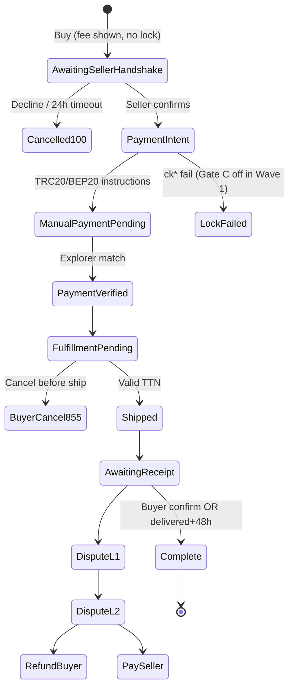
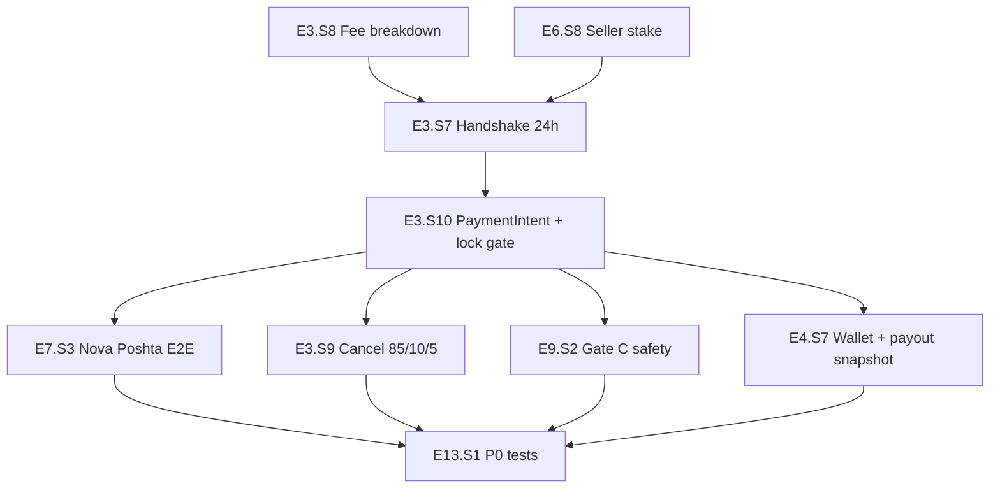

# Implementation Plan — Phase 1.5 (Wave 1)

**Версія:** 2026-05-23  
**Статус:** Implementation-ready handoff (planning only — без app code)  
**Мова:** Українська  
**Scope execution:** **Wave 1 only**; Wave 2/3 — reference sequencing

---

## 1. Мета та scope

### 1.1 Мета

Зробити **один чесний golden path** для Phase 1.5 beta:

> Фізичний товар + Nova Poshta + manual TRC20/BEP20 USDT з platform-coordinated explorer verification — **не** trustless escrow.

Користувач проходить:

```text
Купити → продавець 24h confirm → PaymentIntent → lock/verify коштів
→ відправка NP → отримання/48h → виплата або спір
```

### 1.2 Wave 1 — IN scope (execution)

| Story | Назва |
|-------|-------|
| E3.S8 | Upfront fee breakdown |
| E6.S8 | Seller stake 5% / min 10 USDT |
| E3.S7 | Seller handshake 24h |
| E3.S10 | PaymentIntent + post-handshake lock gate |
| E9.S2 | Safety defaults (Gate C off, handshake gate on ICRC path) |
| E4.S7 | Wallet linking + payout snapshot |
| E7.S3 | Nova Poshta E2E |
| E3.S9 | Buyer cancel pre-ship 85/10/5 |
| E13.S1 | P0 race test suite (launch gate) |

**Implicit in Wave 1 (enhance existing):** E4.S2 explorer-only manual verify — без окремого story ID; AC в E3.S10.

### 1.3 Wave 2/3 — documented (full plans)

| Wave | Plan | Stories |
|------|------|---------|
| **Wave 2** | [IMPLEMENTATION-PLAN-WAVE-2.md](./IMPLEMENTATION-PLAN-WAVE-2.md) | E2.S11, E7.S2-enhance, E6.S9 |
| **Wave 3** | [IMPLEMENTATION-PLAN-WAVE-3.md](./IMPLEMENTATION-PLAN-WAVE-3.md) | E9.S6, E9.S3, E10.S4, E6.S6/E6.S7, E3.S11, E4.S8 |

Master roadmap: [ROADMAP-WAVES.md](./ROADMAP-WAVES.md)

---

## 2. Target trade state machine

Повна специфікація: [TRADE-STATE-MACHINE.md](./TRADE-STATE-MACHINE.md)



---

## 3. Story dependency graph



---

## 4. Wave 1 — порядок implementation

| # | Story | Залежить від | Пріоритет |
|---|-------|--------------|-----------|
| 1 | **E3.S8** | E2.S3 (listing buy) | P0 |
| 2 | **E4.S7** | E1.S1 | P0 |
| 3 | **E6.S8** | E2.S1, E4.S7 | P0 |
| 4 | **E3.S7** | E3.S8, E6.S8 | P0 |
| 5 | **E3.S10** | E3.S7, E4.S2 | P0 |
| 6 | **E9.S2** | E3.S10, E9.S1 (done design) | P0 |
| 7 | **E7.S3** | E3.S10; owner-approved deliveryPolicy unlock | P0 |
| 8 | **E3.S9** | E3.S10, E7.S3 (ship gate) | P0 |
| 9 | **E13.S1** | All Wave 1 above | P0 gate |

---

## 5. Wave 1 stories — детальні AC

### 5.1 E3.S8 — Upfront fee breakdown

**Залежить від:** E2.S3  
**Decision refs:** D-001, D-018

#### Acceptance criteria (testable)

1. Given listing detail, when buyer opens buy/checkout, then UI shows: **item price**, **platform fee (3%)**, **network fee hint**, **NP delivery**, **total before commit**.
2. Given admin `platformFeeBps = 300`, when fee rendered, then amount = `ceil(price × 0.03)` in listing token with correct decimals.
3. Given pre-handshake state, when copy rendered, then includes: *«Ваші кошти ще не заблоковано.»*
4. Given fee config missing, when screen loads, then show admin default 3% — **never hide fee**.

#### Touchpoints

| Layer | Files / modules |
|-------|-----------------|
| Backend | `Admin.mo` — `platformFeeBps`; `escrow-api.mo` — fee quote query |
| Frontend | `ListingDetailPage.tsx`, buy modal/checkout component, i18n |
| Tests | `Escrow.test.mo` fee math; flow `listing-buy-signin-guard` |

#### Definition of Done

- [ ] Fee visible before trade creation
- [ ] Backend single source of truth for bps
- [ ] i18n UA strings for fee lines
- [ ] No regression on existing buy flow

---

### 5.2 E6.S8 — Seller listing stake

**Залежить від:** E2.S1, E4.S7 (recommended)  
**Decision refs:** D-008, D-010

#### Acceptance criteria

1. Given listing price P, when seller publishes, then required stake = **max(0.05×P, 10 USDT)** in listing token.
2. Given insufficient stake balance, when publish attempted, then listing stays draft with clear error.
3. Given active trade on listing, when seller requests stake withdrawal, then **rejected**.
4. Given seller-fault moderator outcome, when settlement runs, then stake seizure queued up to obligation.
5. Given concurrent trades on same listing, when second buyer buys, then stake reservation is **atomic** — no double spend.

#### Touchpoints

| Layer | Files / modules |
|-------|-----------------|
| Backend | New `Stake.mo` + `stake-api.mo`; `Marketplace.mo` publish gate |
| Frontend | `CreateListingPage.tsx` — stake UX, balance check |
| Tests | `Stake.test.mo`; stake lifecycle in `Escrow.test.mo` |

#### Definition of Done

- [ ] Cannot publish without locked stake
- [ ] Stake reserved per active trade
- [ ] Seizure hook on seller-fault dispute path
- [ ] Beta cap 500 USDT enforced at trade init

---

### 5.3 E3.S7 — Seller handshake 24h

**Залежить від:** E3.S8, E6.S8  
**Decision refs:** D-006

#### Acceptance criteria

1. Given buyer taps Buy, when trade created, then state = `awaiting_seller_handshake` and **no payment CTA**.
2. Given handshake active, when seller opens trade, then confirm/decline actions + countdown to `sellerResponseDeadline` (24h).
3. Given seller confirms within 24h, when confirm processed, then transition to `payment_intent` (E3.S10).
4. Given 24h elapsed without action, when timer fires, then terminal `cancelled_no_seller_response` — buyer **100%**, no lock, **no stake penalty**.
5. Given confirm vs timeout race, when both arrive, then **deterministic single terminal** (idempotent).
6. Given seller declines, when processed, then same as timeout — 100% buyer, no lock.

#### Touchpoints

| Layer | Files / modules |
|-------|-----------------|
| Backend | `Escrow.mo` — new states; `escrow-api.mo` — confirm/decline/timeout job |
| Frontend | `TradeDetailPage.tsx`, `EscrowTimeline.tsx`, seller notifications |
| Tests | Handshake timeout race; upgrade mid-handshake resume |

#### Definition of Done

- [ ] No legacy `#pending` immediate payable for new trades
- [ ] Persistent deadlines survive upgrade
- [ ] Seller/buyer notifications at 24h/12h/1h (minimum: expiry)

---

### 5.4 E3.S10 — PaymentIntent + post-handshake lock gate

**Залежить від:** E3.S7, E4.S2  
**Decision refs:** D-007, D-011, D-015, D-016, D-024

#### Acceptance criteria

1. Given seller confirmed trade, when PaymentIntent created, then record: token, network, exact amount (price+fee), recipient/escrow address, expiry (72h), path `manual|ck`.
2. Given handshake incomplete, when buyer attempts pay/lock, then **rejected** with UA message.
3. Given manual path, when buyer submits tx hash, then **only** explorer-verified match advances to `payment_verified` — disable spoof verify endpoint.
4. Given explorer mismatch (wrong chain, token, from, to, amount, confirmations), when verify, then stay pending + structured error.
5. Given PaymentIntent expires before explorer match, when late verification arrives, then trade stays expired/manual_review and does not become `payment_verified`.
6. Given payment verified, when seller attempts ship, then allowed; before verify — **blocked**.
7. Given payout wallet snapshot at intent creation, when seller changes linked wallet after lock, then payout **held/rejected**.
8. Given ICRC path attempted while manual verified, then **mutually exclusive** — second path rejected.

#### Touchpoints

| Layer | Files / modules |
|-------|-----------------|
| Backend | `Types.mo` PaymentIntent; `escrow-api.mo`, `payments-api.mo` |
| Frontend | `TradeDetailPage.tsx`, `PaymentVerificationWidget.tsx` |
| Tests | Wrong token/network; duplicate payment prevention |

#### Definition of Done

- [ ] PaymentIntent schema in types + stable storage
- [ ] No `paid` state without verification
- [ ] Shipping/digital reveal blocked pre-funding

---

### 5.5 E9.S2 — Safety defaults (Wave 1 scope)

**Залежить від:** E3.S10  
**Decision refs:** D-004, D-016

**Wave 1 scope:** handshake gate + **Gate C default false** — NOT beta enable.

#### Acceptance criteria

1. Given fresh deploy / prod config, when `getPlatformFlags()`, then `trustlessEscrowEnabled = false`.
2. Given Gate C false, when buyer attempts `initiateOnChainTrade`, then rejected before ledger call.
3. Given handshake pending, when on-chain lock attempted, then rejected (even if flag on in dev).
4. Given ICRC lock fails after handshake, when error returned, then rollback to `payment_intent` — **not** ghost funded.
5. Given `initiateOnChainTrade` interleaving, when concurrent calls, then no unsafe `nextTradeId` rollback.

#### Touchpoints

| Layer | Files / modules |
|-------|-----------------|
| Backend | `escrow-api.mo`, `Admin.mo` — default flag false |
| Frontend | Hide on-chain CTA when flag false |
| Docs | Update `ONCHAIN-SETTLEMENT-DESIGN.md` default to false |

#### Definition of Done

- [ ] Prod default false documented and enforced
- [ ] ICRC failure rollback tests green
- [ ] No marketing "trustless" for manual path

---

### 5.6 E4.S7 — Wallet linking + payout snapshot

**Залежить від:** E1.S1  
**Decision refs:** D-015

#### Acceptance criteria

1. Given logged-in user, when linking external wallet via signed nonce, then address bound to II principal.
2. Given multiple linked wallets, when payment/stake action, then user selects wallet.
3. Given PaymentIntent creation, when snapshot taken, then payout address immutable for trade lifecycle.
4. Given wrong-chain linked wallet, when user selects for TRC20 trade, then validation error before intent.

#### Touchpoints

| Layer | Files / modules |
|-------|-----------------|
| Backend | `auth-api.mo` wallet links; trade snapshot field |
| Frontend | Wallet connect UI, profile wallets section |
| Tests | Snapshot immutability; changed wallet rejection |

#### Definition of Done

- [ ] Principal-wallet binding with nonce
- [ ] Payout snapshot on PaymentIntent
- [ ] Anti-phishing copy on connect

---

### 5.7 E7.S3 — Nova Poshta E2E

**Залежить від:** E3.S10; owner-approved deliveryPolicy unlock  
**Decision refs:** D-003, D-012, D-019

#### Acceptance criteria

1. Given physical listing, when create/edit, then **Nova Poshta only** — pickup hidden (`deliveryPolicy.ts` unlock).
2. Given invalid TTN format, when seller marks shipped, then **rejected** — stay `fulfillment_pending`.
3. Given valid TTN, when carrier accepts, then state → `shipped` + timeline in trade chat.
4. Given `payment_verified` / `funded_locked`, when seller does not provide a valid TTN within **7 days**, then escalate to dispute/refund path and keep payout blocked.
5. Given NP status `delivered`/`вручено`, when 48h elapsed without dispute, then auto → `complete`.
6. Given `Arrived at branch` status, then **not** treated as delivered.
7. Given buyer confirms receipt before 48h, then → `complete` immediately.
8. Given NP API unavailable, when auto-complete job runs, then **fail-closed** — no completion.
9. Given dispute open during delivered grace, then **payout frozen**.

#### Touchpoints

| Layer | Files / modules |
|-------|-----------------|
| Backend | `Shipping.mo`, `shipping-api.mo` |
| Frontend | `deliveryPolicy.ts`, `ShippingTracker.tsx`, create listing carrier |
| Tests | `Shipping.test.mo`; invalid TTN; API outage |

#### Definition of Done

- [ ] NP visible in UI for physical goods
- [ ] Completion rules match D-003
- [ ] Fail-closed on API/TTN errors

---

### 5.8 E3.S9 — Buyer cancel pre-ship 85/10/5

**Залежить від:** E3.S10, E7.S3 (shipment gate)  
**Decision refs:** D-009, D-025

#### Acceptance criteria

1. Given `payment_verified` and not shipped, when buyer cancels, then split: **85%** buyer, **10%** seller, **5%** platform on locked/coordinated amount.
2. Given shipment recorded (valid TTN), when buyer cancel attempted, then **rejected**.
3. Given split with rounding dust, when settled, then deterministic dust → platform (fixed-point).
4. Given cancel confirmation UI, when shown, then exact amounts displayed before confirm.

#### Touchpoints

| Layer | Files / modules |
|-------|-----------------|
| Backend | `Escrow.mo` cancel transition + fee math |
| Frontend | Cancel modal with amount breakdown |
| Tests | 85/10/5 dust; cancel vs shipped race |

#### Definition of Done

- [ ] Unilateral buyer cancel path post-funding pre-ship
- [ ] Exact copy per contract R3
- [ ] Race with seller ship handled deterministically

---

### 5.9 E13.S1 — P0 race test suite (launch gate)

**Залежить від:** All Wave 1 stories  
**Decision refs:** Council Red-team QA synthesis

#### Acceptance criteria

1. Automated test file(s) cover minimum 16 P0 scenarios (see §7 matrix).
2. CI / `mops test` runs P0 suite; failure blocks release tag.
3. Each test maps to story ID(s) in test name or comment.
4. Upgrade mid-handshake test uses persisted deadline fixture.

#### Touchpoints

| Layer | Files / modules |
|-------|-----------------|
| Tests | `test/Escrow.test.mo`, `test/Payments.test.mo`, `test/Shipping.test.mo`, `test/Stake.test.mo` |
| CI | `npm run verify` or dedicated `test:p0` script |

#### Definition of Done

- [ ] All P0 matrix rows have test coverage
- [ ] Documented in story E13.S1 file
- [ ] Green before beta announcement

---

## 6. Wave 2 / Wave 3 — full plans available

See dedicated implementation plans (same depth as Wave 1):

- **Wave 2:** [IMPLEMENTATION-PLAN-WAVE-2.md](./IMPLEMENTATION-PLAN-WAVE-2.md) — order: E2.S11 → E7.S2 → E6.S9
- **Wave 3:** [IMPLEMENTATION-PLAN-WAVE-3.md](./IMPLEMENTATION-PLAN-WAVE-3.md) — order: E9.S6 → E9.S3 → E10.S4 → E6.S6 → E6.S7 → E3.S11 → E4.S8
- **Master:** [ROADMAP-WAVES.md](./ROADMAP-WAVES.md)

---

## 7. P0 test matrix

| # | Race / scenario | Story | Test module |
|---|-----------------|-------|-------------|
| 1 | Seller confirm vs 24h timeout race | E3.S7 | `Escrow.test.mo` |
| 2 | Seller silent → 100% cancel, no lock, no stake penalty | E3.S7 | `Escrow.test.mo` |
| 3 | Buyer cancel vs seller shipped race | E3.S9, E7.S3 | `Escrow.test.mo` |
| 4 | 85/10/5 split with rounding/dust | E3.S9 | `Escrow.test.mo` |
| 5 | Two buyers on one listing | E3.S7, E6.S8 | `Escrow.test.mo` |
| 6 | Stake locked once; no withdraw during pending trade/dispute | E6.S8 | `Stake.test.mo` |
| 7 | ICRC failure rollback after handshake | E9.S2 | `Escrow.test.mo` |
| 8 | ICRC funded + manual paid duplicate prevention | E3.S10, E9.S2 | `Payments.test.mo` |
| 9 | Manual wrong token/network/underpay rejection | E3.S10, E4.S2 | `Payments.test.mo` |
| 10 | Invalid TTN cannot mark shipped | E7.S3 | `Shipping.test.mo` |
| 11 | NP arrived-at-branch is not delivered | E7.S3 | `Shipping.test.mo` |
| 12 | NP delivered + buyer dispute freezes payout | E7.S3, E6.S1 | `Escrow.test.mo` |
| 13 | Payout wallet changed after lock rejected/held | E4.S7, E3.S10 | `Escrow.test.mo` |
| 14 | PaymentIntent expiry vs late explorer verify | E3.S10, E4.S2 | `Payments.test.mo` |
| 15 | Seller misses 7-day ship-by SLA → dispute/refund escalation, payout blocked | E7.S3 | `Escrow.test.mo` |
| 16 | Upgrade mid-handshake resumes deadlines | E3.S7 | `Escrow.test.mo` |
| 17 | Compliance launch gate unsigned → beta launch blocked | E13.S1 | `COMPLIANCE-LAUNCH-GATE.md` evidence |

---

## 8. Launch checklist — honest Phase 1.5 beta

- [ ] Golden path NP + manual TRC20/BEP20 E2E with real explorer verify
- [ ] No path to `paid`/`locked` without handshake + verification
- [ ] Gate C **disabled** in prod; copy says coordinated manual, not trustless
- [ ] Seller stake blocks publish; **500 USDT** trade cap visible in UI
- [ ] Platform fee **3%** shown before Buy
- [ ] P0 test matrix (§7) green in CI
- [ ] Insurance / full-refund **absent** from marketing
- [ ] `/how-payments-work` aligned with handshake-before-lock
- [ ] NP completion: buyer confirm OR delivered+48h (D-003)
- [ ] Moderator dispute path works with payout freeze

---

## 9. Decision log (defaults)

Повна таблиця: [DECISION-LOG.md](./DECISION-LOG.md)

| Topic | Default |
|-------|---------|
| Platform fee | **3%** |
| Manual chains Wave 1 | **TRC20 USDT + BEP20 USDT** |
| NP completion | **Buyer confirm OR delivered + 48h** no dispute |
| Gate C | **Off by default** |
| Insurance | **Wave 3 only** — no guarantee copy Wave 1 |
| Beta trade cap | **500 USDT** |

---

## 10. Sibling artifacts (navigation)

| Артефакт | Шлях |
|----------|------|
| User promises | [USER-PRODUCT-CONTRACT.md](./USER-PRODUCT-CONTRACT.md) |
| Launch promises | [PHASE-1.5-LAUNCH-PROMISES.md](./PHASE-1.5-LAUNCH-PROMISES.md) |
| Council findings | [COUNCIL-FINDINGS.md](./COUNCIL-FINDINGS.md) |
| Course correction | [COURSE-CORRECTION.md](./COURSE-CORRECTION.md) |
| Gap analysis | [gap-analysis.md](./gap-analysis.md) |
| State machine spec | [TRADE-STATE-MACHINE.md](./TRADE-STATE-MACHINE.md) |
| Decisions | [DECISION-LOG.md](./DECISION-LOG.md) |
| PRD | [prd.md](./prd.md) |
| Epics | [epics.md](./epics.md) |
| On-chain design | [docs/bmad/ONCHAIN-SETTLEMENT-DESIGN.md](../../docs/bmad/ONCHAIN-SETTLEMENT-DESIGN.md) |
| Story index | [_bmad-output/implementation-artifacts/stories/index.md](../implementation-artifacts/stories/index.md) |
| Sprint status | [_bmad-output/implementation-artifacts/sprint-status.yaml](../implementation-artifacts/sprint-status.yaml) |
| Index | [INDEX.md](./INDEX.md) |

---

*Handoff complete when Wave 1 stories in manifest have `dependsOn`, build script exits 0, and §8 checklist tracked in sprint.*
