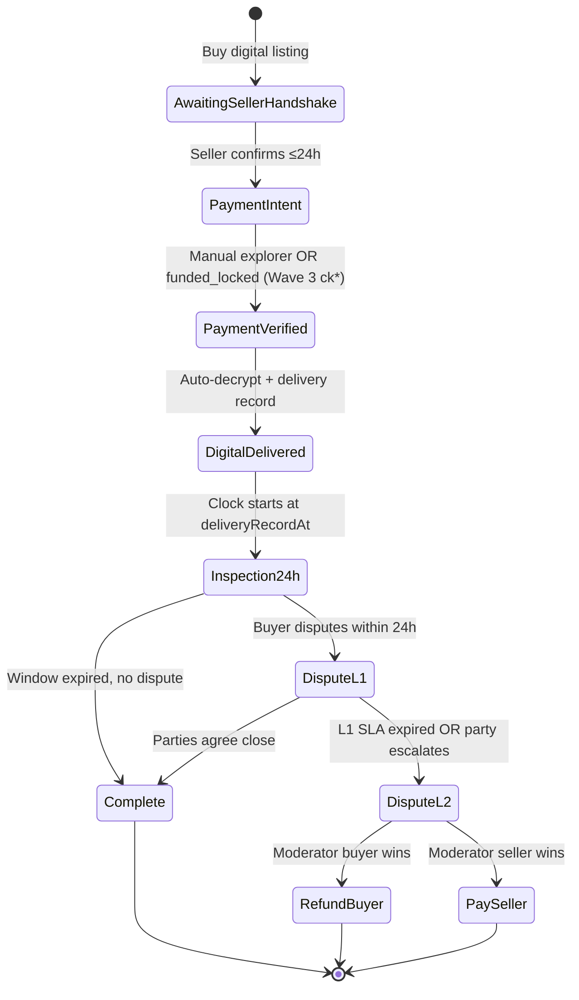
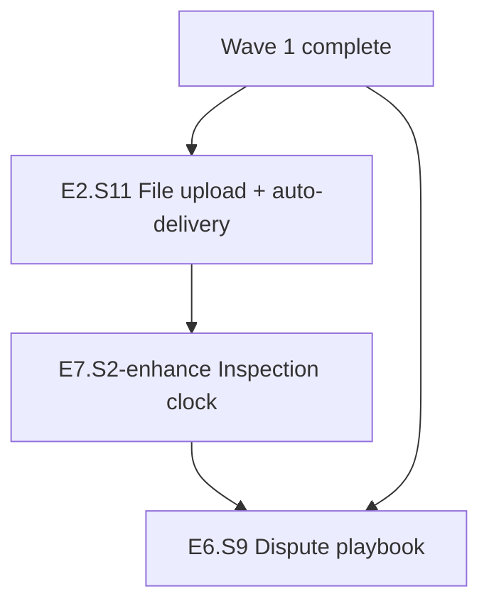

# Implementation Plan — Wave 2 (Digital + Dispute Playbook)

**Версія:** 2026-05-23  
**Статус:** Implementation-ready handoff (planning only — без app code)  
**Мова:** Українська  
**Prerequisite:** Wave 1 golden path shipped ([IMPLEMENTATION-PLAN-PHASE-1.5.md](./IMPLEMENTATION-PLAN-PHASE-1.5.md) §8 checklist green)

---

## 1. Мета та scope

### 1.1 Мета

Додати **другий чесний golden path** — цифрові товари (файли) з автоматичною доставкою після funding та **продуктовий dispute playbook** (L1/L2) для фізичних і цифрових угод.

> Цифровий товар + encrypted auto-delivery + 24h inspection + L1/L2 disputes — **не** DRM, **не** keys/text/license strings.

Користувач проходить:

```text
Купити → продавець 24h confirm → PaymentIntent → lock/verify
→ auto-delivery файлу → 24h inspection → complete або спір L1 → L2 модератор
```

### 1.2 Wave 2 — IN scope

| Story | Назва |
|-------|-------|
| E2.S11 | Digital file upload + encrypted immutable storage |
| E7.S2-enhance | 24h inspection від delivery record; redownload не скидає таймер |
| E6.S9 | Dispute playbook — L1/L2, freeze, evidence, moderator SLA | done | **done** |

**Implicit:** Wave 1 handshake/lock/NP paths залишаються; Wave 2 **розширює** state machine гілкою digital + formalize disputes.

### 1.3 OUT of Wave 2

| Item | Wave / defer |
|------|--------------|
| Gate C on-chain escrow | Wave 3 (E9.S6) |
| Insurance / reserve fund | Wave 3 (E10.S4) |
| High-value caps >1000 USDT | Wave 3 (E3.S11) |
| ERC20 manual enable | Wave 3 (E4.S8) |
| Jury dashboard | Wave 4+ (E6.S4) |
| Self-pickup / meetup | Wave 4+ (E7.S1) |
| DRM / anti-copy guarantees | Ніколи |

---

## 2. Target state machine — digital branch

Повна специфікація: [TRADE-STATE-MACHINE.md](./TRADE-STATE-MACHINE.md) §2–§5 (digital + dispute L1/L2).



---

## 3. Story dependency graph



---

## 4. Wave 2 — порядок implementation

| # | Story | Залежить від | Пріоритет |
|---|-------|--------------|-----------|
| 1 | **E2.S11** | E3.S10, Wave 1 | P0 |
| 2 | **E7.S2-enhance** | E2.S11 | P0 |
| 3 | **E6.S9** | E6.S1, E6.S2, E7.S3, E2.S11, E7.S2-enhance | P0 |

---

## 5. Wave 2 stories — детальні AC

### 5.1 E2.S11 — Digital file upload and auto-delivery

**Залежить від:** E3.S10 (post-handshake funding gate), Wave 1  
**Decision refs:** D-013, D-026, D-027, D-028

#### Acceptance criteria (testable)

1. Given digital listing create, when seller uploads file, then ciphertext stored with **random per-listing DEK**, **SHA-256 hash**, size, MIME, and immutable `fileVersionId` linked to listing.
2. Given file upload, when MIME not in allowlist (pdf, zip, png, jpg, epub, mp4 ≤500MB beta), then rejected with UA error.
3. Given active trades on listing, when seller attempts file replace, then **rejected** — replacement applies only to future listings/trades.
4. Given trade in `payment_verified` or `funded_locked`, when auto-delivery job runs, then buyer receives decrypt key/download URL and state → `digital_delivered`; **no** key/URL before funding.
5. Given handshake incomplete or payment unverified, when buyer requests download, then **403** with message *«Файл буде доступний після підтвердження оплати.»*
6. Given auto-delivery, when `deliveryRecordAt` is persisted by E2.S11, then E7.S2 inspection timer starts from this timestamp — **not** first page load.
7. Given seller at fault digital dispute (placeholder/wrong file hash), when moderator resolves buyer wins, then refund path per Wave 1 settlement rules + stake seizure queue.
8. Given malware scan/quarantine hook (beta: size+MIME+hash blocklist), when flagged file uploaded, then listing stays draft and admin audit entry created.

#### Touchpoints

| Layer | Files / modules |
|-------|-----------------|
| Backend | `object-storage-api.mo`, `Escrow.mo`, `escrow-api.mo`, new `DigitalDelivery.mo` |
| Frontend | `CreateListingPage.tsx` (digital upload), `TradeDetailPage.tsx` (download panel) |
| Storage | Encrypted blob via Caffeine object storage; authenticated gateway binding |
| Tests | `Escrow.test.mo` digital paths, `Marketplace.test.mo` listing gate |

#### Definition of Done

- [ ] No plaintext public URL before funding
- [ ] Immutable fileVersionId per listing revision
- [ ] Auto-delivery triggers on payment_verified only
- [ ] Upload allowlist + max size enforced
- [ ] i18n: no DRM promise; inspection window copy

---

### 5.2 E7.S2-enhance — Digital inspection window (24h)

**Залежить від:** E2.S11  
**Decision refs:** D-029, D-030, D-012 (digital parallel to NP grace)

#### Acceptance criteria

1. Given `digital_delivered` with `deliveryRecordAt = T`, when buyer opens trade, then countdown shows **T + 24h** deadline.
2. Given buyer redownloads file at T+12h, when page refreshes, then deadline **unchanged** (still T+24h).
3. Given inspection window active, when buyer opens dispute, then trade → `dispute_l1` and auto-complete **paused**.
4. Given window expired without dispute, when timer fires, then → `complete` and seller payout proceeds per fee schedule.
5. Given dispute resolved pay-seller during inspection, when outcome applied, then → `complete` with moderator timestamp.
6. Given buyer attempts dispute after T+24h, then rejected unless moderator reopen flag (admin-only beta).
7. Given concurrent auto-complete vs dispute open, when both arrive, then **dispute wins** — deterministic single terminal path.

#### Touchpoints

| Layer | Files / modules |
|-------|-----------------|
| Backend | `Escrow.mo` — `digitalInspectionDeadline`, `deliveryRecordAt` |
| Frontend | `TradeDetailPage.tsx`, `EscrowTimeline.tsx` — inspection countdown |
| Tests | Redownload-no-reset; dispute-pause-auto-complete race |

#### Definition of Done

- [ ] Deadline persisted in stable storage
- [ ] Upgrade resumes inspection timers (P0 test)
- [ ] Copy: *«Після завантаження у вас 24 год на перевірку. Повторне завантаження не продовжує термін.»*

---

### 5.3 E6.S9 — Dispute playbook (L1/L2)

**Залежить від:** E6.S1, E6.S2, E7.S3 (physical), E2.S11 + E7.S2 (digital)  
**Decision refs:** D-014, D-017, D-031, D-032, D-033

#### Acceptance criteria

**States & freeze**

1. Given post-shipment physical OR post-delivery digital, when dispute opened, then trade → `dispute_l1` and **payout frozen** (no release, no auto-complete).
2. Given dispute_l1, when either party or system escalates after L1 SLA, then → `dispute_l2` and moderator queue entry.
3. Given dispute_l2, when moderator resolves, then exactly one terminal: `refunded` (buyer) or `paid_seller` — idempotent.

**Evidence checklist (UA UI)**

4. Given physical dispute opened by buyer, when form renders, then required: TTN screenshot, package photos (min 2), chat export link, reason enum.
5. Given digital dispute opened by buyer, when form renders, then required: file hash shown, download timestamp, reason enum, optional screenshot.
6. Given incomplete evidence, when submit attempted, then inline validation — dispute stays draft.

**SLA (defaults — D-031)**

7. Given dispute_l1 physical, when opened, then L1 SLA = **24h**; digital L1 SLA = **6h**.
8. Given dispute_l2, when queued, then moderator triage target **4–12h**; decision target **24–72h** (admin dashboard shows overdue).
9. Given L1 SLA expired without resolution, when job runs, then auto-escalate to L2.

**Outcomes & liability**

10. Given seller-fault refund outcome, when settlement runs, then stake seizure + liability record (E6.S6) + account restriction if residual (E6.S7).
11. Given buyer-fault pay-seller outcome, when applied, then buyer reputation penalty + dispute closed.
12. Given dispute during NP 48h grace or digital 24h inspection, when open, then auto-complete **blocked**.

#### Touchpoints

| Layer | Files / modules |
|-------|-----------------|
| Backend | `Disputes.mo`, `disputes-api.mo`, `Escrow.mo` freeze flags |
| Frontend | `DisputeModal.tsx`, admin dispute queue with SLA badges |
| Docs | Moderator runbook section in this plan §8 |
| Tests | `Disputes.test.mo` L1/L2 freeze, SLA escalation, evidence validation |

#### Definition of Done

- [x] L1/L2 states in Types.mo + Escrow sync
- [x] Freeze blocks payout and auto-complete jobs
- [x] Evidence checklist enforced in UI
- [x] SLA timers visible to moderators
- [x] Jury path remains disabled (E6.S4)

---

## 6. P1 test matrix (Wave 2 launch gate)

| # | Scenario | Story | Test module |
|---|----------|-------|-------------|
| W2-1 | Digital delivery blocked before payment_verified | E2.S11 | `Escrow.test.mo` |
| W2-2 | Seller file replacement blocked with active trade | E2.S11 | `Escrow.test.mo` |
| W2-3 | Auto-delivery creates deliveryRecordAt | E2.S11 | `Escrow.test.mo` |
| W2-4 | Redownload does not reset 24h inspection | E7.S2 | `Escrow.test.mo` |
| W2-5 | Inspection auto-complete at T+24h | E7.S2 | `Escrow.test.mo` |
| W2-6 | Dispute during inspection pauses auto-complete | E7.S2, E6.S9 | `Escrow.test.mo` |
| W2-7 | Dispute L1 opens → payout frozen | E6.S9 | `Disputes.test.mo` |
| W2-8 | L1 SLA expiry → auto L2 escalation | E6.S9 | `Disputes.test.mo` |
| W2-9 | Moderator L2 → single terminal outcome | E6.S9 | `Disputes.test.mo` |
| W2-10 | Physical NP dispute + delivered grace freeze | E6.S9, E7.S3 | `Escrow.test.mo` |
| W2-11 | Incomplete evidence rejected | E6.S9 | `Disputes.test.mo` |
| W2-12 | Upgrade mid-inspection resumes deadline | E7.S2 | `Escrow.test.mo` |

---

## 7. Launch checklist — honest Wave 2

- [ ] Wave 1 checklist ([IMPLEMENTATION-PLAN-PHASE-1.5.md §8](./IMPLEMENTATION-PLAN-PHASE-1.5.md)) still green
- [ ] Digital golden path E2E: upload → buy → handshake → pay → auto-delivery → inspection → complete
- [ ] Copy states **no DRM**; 24h inspection from delivery record
- [ ] Dispute L1/L2 works for physical **and** digital trades
- [ ] Moderator SLA dashboard shows overdue queue
- [ ] W2 test matrix (§6) green in CI
- [ ] Insurance / Gate C **still not** in marketing

---

## 8. Moderator runbook (summary)

| Level | Trigger | SLA | Actions |
|-------|---------|-----|---------|
| L1 | Party opens dispute post-fulfillment | 24h physical / 6h digital | Chat mediation; evidence checklist |
| L2 | L1 timeout or escalation | Triage 4–12h; decision 24–72h | Refund buyer / pay seller; stake seizure if seller fault |
| Appeal | Post-L2 (beta: admin reopen only) | 7 days | Documented exception — jury deferred Wave 4+ |

Evidence pack minimum: TTN + photos (physical); hash + download log (digital); full trade chat thread ID.

---

## 9. Decision log refs

| Topic | Default | ID |
|-------|---------|-----|
| Digital files Wave | Wave 2 after Wave 1 | D-013 |
| Inspection window | 24h from deliveryRecordAt | D-029 |
| Redownload timer reset | **Never** | D-030 |
| L1 SLA physical / digital | 24h / 6h | D-031 |
| L2 moderator SLA | Triage 4–12h; decision 24–72h | D-032 |
| Jury | Deferred Wave 4+ | D-014 |
| DRM promise | Never | D-028 |

Повна таблиця: [DECISION-LOG.md](./DECISION-LOG.md)

---

## 10. Sibling artifacts

| Артефакт | Шлях |
|----------|------|
| Wave 1 plan | [IMPLEMENTATION-PLAN-PHASE-1.5.md](./IMPLEMENTATION-PLAN-PHASE-1.5.md) |
| Wave 3 plan | [IMPLEMENTATION-PLAN-WAVE-3.md](./IMPLEMENTATION-PLAN-WAVE-3.md) |
| Master roadmap | [ROADMAP-WAVES.md](./ROADMAP-WAVES.md) |
| State machine | [TRADE-STATE-MACHINE.md](./TRADE-STATE-MACHINE.md) |
| Launch promises | [PHASE-1.5-LAUNCH-PROMISES.md](./PHASE-1.5-LAUNCH-PROMISES.md) |
| Gap analysis | [gap-analysis.md](./gap-analysis.md) |

---

*Handoff complete when Wave 2 stories in manifest have full AC, W2 test matrix tracked, and §7 checklist green.*
