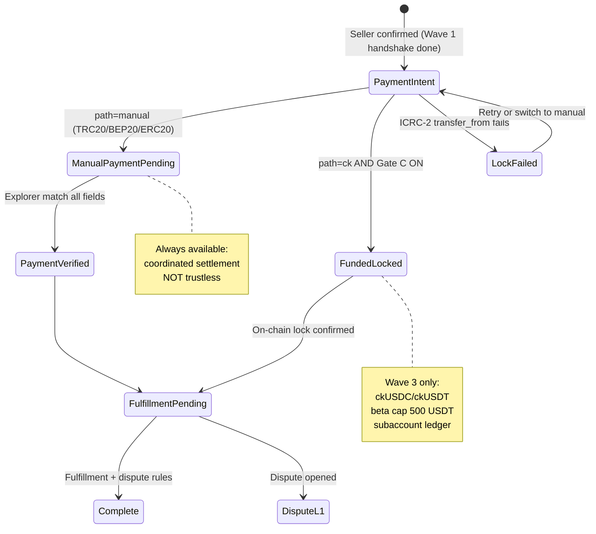
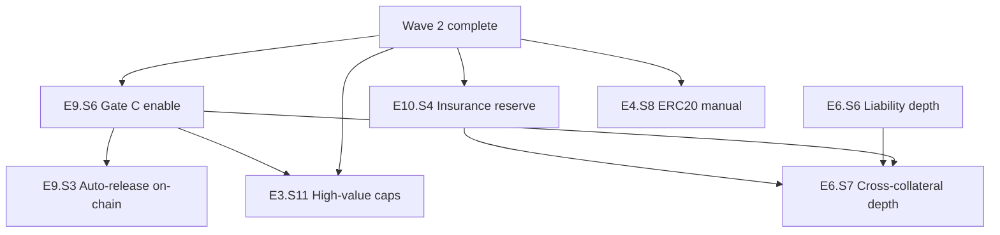

# Implementation Plan — Wave 3 (Gate C + Insurance + High-Value)

**Версія:** 2026-05-23  
**Статус:** Implementation complete (Wave 3 code shipped 2026-05-23; beta launch checklist partial)  
**Мова:** Українська  
**Prerequisite:** Wave 1 green + Wave 2 digital/disputes shipped ([IMPLEMENTATION-PLAN-WAVE-2.md §7](./IMPLEMENTATION-PLAN-WAVE-2.md))

---

## 1. Мета та scope

### 1.1 Мета

Увімкнути **обмежений trustless шлях** (ckUSDC/ckUSDT після security review), **capped insurance reserve** з чесним copy, **liability waterfall depth** для manual vs on-chain, та **high-value trade gates**.

> Wave 3 = ck* on-chain beta + capped reserve + liability depth — **не** omnichain trustless, **не** full insurance guarantee.

### 1.2 Wave 3 — IN scope

| Story | Назва |
|-------|-------|
| E9.S6 | Gate C beta enable — ckUSDC/ckUSDT ICRC-2 lock post-handshake |
| E10.S4 | Capped insurance reserve policy + ledger |
| E6.S6-depth | Global liability IDs, partial clear, audit trail |
| E6.S7-depth | Cross-collateral waterfall + honest manual vs on-chain copy |
| E3.S11 | High-value trade caps and tier gates |
| E4.S8 | ERC20 USDC manual path enable (post security review) |

**Implicit:** E9.S3 auto-release rules must ship with Gate C enable.

### 1.3 OUT of Wave 3

| Item | Defer |
|------|-------|
| Trustless TRC20/BEP20/ERC20 | Roadmap Phase 4+ |
| Jury voting (E6.S4) | Wave 4+ |
| Self-pickup (E7.S1) | Wave 4+ / out-of-scope |
| External KYC provider integration (E12.S2) | Wave 4+ |
| Buyer stake | Wave 4+ |
| Omnichain all networks | Long-term roadmap |
| Governance nav priority (E10.S1) | Product-deferred |

---

## 2. Target state machine — Gate C branch vs manual



Повна специфікація: [TRADE-STATE-MACHINE.md](./TRADE-STATE-MACHINE.md) §10–§12.

---

## 3. Story dependency graph



---

## 4. Wave 3 — порядок implementation

| # | Story | Залежить від | Пріоритет |
|---|-------|--------------|-----------|
| 1 | **E9.S6** | E9.S2, E3.S10, E13.S1, Wave 1–2 | P0 |
| 2 | **E9.S3** | E9.S6 | P0 |
| 3 | **E10.S4** | E3.S8, E10.S3 | P0 |
| 4 | **E6.S6-depth** | E6.S3, E10.S4 | P0 |
| 5 | **E6.S7-depth** | E6.S6, E9.S6, E6.S8 | P0 |
| 6 | **E3.S11** | E9.S6, E6.S8, E10.S4 | P0 |
| 7 | **E4.S8** | E4.S2, E3.S10, E9.S6 | P1 |

---

## 5. Wave 3 stories — детальні AC

### 5.1 E9.S6 — Gate C beta enable

**Залежить від:** E9.S2 safety defaults shipped, E13.S1 P0 green  
**Decision refs:** D-004, D-034, D-035, D-036

#### Acceptance criteria

1. Given prod default, when `getPlatformFlags()`, then `trustlessEscrowEnabled = false` until admin explicit enable **with** security sign-off record.
2. Given Gate C enable requested, when checklist incomplete (testnet E2E, rollback tests, subaccount design, beta caps), then enable **rejected**.
3. Given Gate C ON and seller-confirmed trade, when buyer selects ckUSDC/ckUSDT, then ICRC-2 `transfer_from` → `funded_locked` — **only** post-handshake.
4. Given trade amount > **500 USDT** ck beta cap (D-034), when on-chain path selected, then rejected — manual path offered.
5. Given ICRC lock fails, when error returned, then rollback to `payment_intent` — seller cannot ship (E9.S2).
6. Given manual path already `payment_verified`, when ck lock attempted, then **rejected** (mutually exclusive — D-016).
7. Given Gate C ON, when marketing copy renders, then *«Trustless escrow»* only for ckUSDC/ckUSDT — manual chains keep coordinated copy.
8. Given admin disable Gate C, when in-flight ck trades exist, then existing trades complete under prior rules; new trades manual-only.

#### Touchpoints

| Layer | Files / modules |
|-------|-----------------|
| Backend | `escrow-api.mo`, `Admin.mo`, `Admin.mo` Gate C checklist |
| Frontend | `TradeDetailPage.tsx` — ck path CTA when flag on |
| Docs | `docs/bmad/ONCHAIN-SETTLEMENT-DESIGN.md` Gate C exit criteria |
| Tests | Testnet ICRC E2E; cap enforcement; rollback |

#### Definition of Done

- [ ] Security sign-off checklist stored in admin audit
- [ ] ckUSDC first; ckUSDT second (multi-token UI ready)
- [ ] Beta cap 500 USDT enforced
- [ ] No trustless marketing for manual chains

---

### 5.2 E9.S3 — Auto-release and refund (on-chain)

**Залежить від:** E9.S6  
**Decision refs:** D-004, D-017, D-037

#### Acceptance criteria

1. Given `funded_locked` + fulfillment complete (NP/digital rules), when release conditions met, then `releaseEscrow` transfers to seller minus platform fee on-chain.
2. Given dispute freeze on ck trade, when moderator resolves refund, then on-chain refund to buyer — atomic with state terminal.
3. Given release ICRC call fails, when error, then trade **not** marked terminal — retry job.
4. Given buyer cancel pre-ship on ck path, when processed, then 85/10/5 split executed **on-chain** with dust → platform.

---

### 5.3 E10.S4 — Capped insurance reserve policy

**Залежить від:** E3.S8 (fee accrual), E10.S3 treasury  
**Decision refs:** D-005, D-021, D-038, D-039

#### Acceptance criteria

1. Given reserve policy published, when platform fee accrues, then **40%** of fee (default D-021 mid) credits `insuranceReserveLedger` — not seized stake.
2. Given seller-fault residual after stake seizure, when insurance payout triggered, then payout = **min(unrecovered loss, 20% liquid fund, 100 USDT/user/day, 500 USDT/trade cap)**.
3. Given trade > **500 USDT**, when insurance path evaluated, then **not offered** — UI shows stake-only protection.
4. Given liquid fund = 0, when UI renders protection copy, then **no** «гарантоване повне відшкодування» — only stake + account restrictions.
5. Given insurance payout, when processed, then dual-admin approval required (beta); audit log with liability ID link.
6. Given collusion graph flag (same device/wallet cluster), when payout requested, then hold for manual review.

#### Touchpoints

| Layer | Files / modules |
|-------|-----------------|
| Backend | `Treasury.mo`, new `InsuranceReserve.mo` |
| Frontend | `/how-payments-work`, trade detail protection badge |
| Legal | Non-guarantee disclaimer copy review |
| Tests | Reserve accrual math; cap enforcement; zero-fund copy |

#### Definition of Done

- [ ] Reserve ledger separate from operating treasury
- [ ] Honest copy when fund empty or capped
- [ ] No marketing full-refund until fund solvency target met (admin-configurable)

---

### 5.4 E6.S6-depth — Global liability

**Залежить від:** E6.S3, E10.S4  
**Decision refs:** D-023, D-040

#### Acceptance criteria

1. Given seller-fault outcome, when liability created, then record: `liabilityId`, amount, currency, reason enum, initiator, tradeId, timestamp.
2. Given partial payment from stake, when residual > 0, then liability status `partial` with remaining balance.
3. Given admin partial clear, when applied, then audit entry + updated block rules.
4. Given liability threshold exceeded, when user initiates trade, then blocked with UA message citing liability ID.
5. Given multiple liabilities, when dashboard loads, then sorted by severity + age.

---

### 5.5 E6.S7-depth — Cross-collateral waterfall

**Зalежить від:** E6.S6, E9.S6, E6.S8  
**Decision refs:** D-023, D-041, D-042

#### Liability waterfall (enforced order)

```text
1. Seize seller listing stake S = max(5% × P, 10 USDT)
2. On-chain ck escrow refund (if funded_locked)
3. Cross-wallet collateral (linked wallets with consent — ck only)
4. Capped insurance reserve (E10.S4)
5. Account restriction + unpaid liability record
```

#### Acceptance criteria

1. Given manual `payment_verified` trade + seller fault, when settlement runs, then steps 1 + 5 only — UI copy **never** claims custodial recovery (D-023).
2. Given `funded_locked` ck trade + seller fault, when settlement runs, then steps 1–4 as applicable on-chain.
3. Given waterfall exhausted with residual, when complete, then buyer sees honest copy: *«Часткове відшкодування зі stake/резерву; решта — обмеження акаунта продавця.»*
4. Given insurance fund payout, when stake also available, then stake seized **first** — insurance is last resort.

---

### 5.6 E3.S11 — High-value trade caps and tier gates

**Зalежить від:** E9.S6, E6.S8, E10.S4  
**Decision refs:** D-010, D-022, D-043

#### Acceptance criteria

1. Given trade amount ≤ **500 USDT**, when init allowed, then standard beta rules (Wave 1 cap).
2. Given 500 < amount ≤ **1000 USDT**, when buyer initiates, then requires seller **verified tier** (E12.S2 admin) OR **elevated stake 10%** (min 50 USDT).
3. Given amount > **1000 USDT**, when buyer initiates, then **ckUSDC/ckUSDT only** (Gate C must be ON) — manual path rejected.
4. Given amount > **5000 USDT**, when init attempted, then rejected — *«Поза лімітом beta.»*
5. Given caps, when UI renders buy screen, then tier requirements visible before commit.

---

### 5.7 E4.S8 — ERC20 USDC manual path enable

**Зalежить від:** E4.S2 explorer, E3.S10 PaymentIntent  
**Decision refs:** D-002, D-044

#### Acceptance criteria

1. Given ERC20 USDC selected post Wave 3 security review, when PaymentIntent created, then gas warning copy shown (*«Висока комісія мережі Ethereum.»*).
2. Given ERC20 tx, when explorer verifies, then same field matching as TRC20/BEP20 (chain, contract, from, to, amount, confirmations ≥12).
3. Given Gate C ON, when ERC20 manual and ck both available, then user picks one path — mutually exclusive.
4. Given beta, when ERC20 enabled, then cap **500 USDT** same as other manual chains unless tier gates (E3.S11) apply.

---

## 6. P1 test matrix (Wave 3 launch gate)

| # | Scenario | Story | Test module |
|---|----------|-------|-------------|
| W3-1 | Gate C off by default in prod config | E9.S6 | `Escrow.test.mo` |
| W3-2 | ck lock only post-handshake | E9.S6 | `Escrow.test.mo` |
| W3-3 | ck trade >500 USDT rejected | E9.S6, E3.S11 | `Escrow.test.mo` |
| W3-4 | ICRC release after NP complete | E9.S3 | testnet E2E |
| W3-5 | ICRC refund on dispute buyer wins | E9.S3 | testnet E2E |
| W3-6 | Reserve accrual 40% of fee | E10.S4 | `Treasury.test.mo` |
| W3-7 | Insurance payout capped min(loss, 20% fund, daily) | E10.S4 | `Treasury.test.mo` |
| W3-8 | Zero fund → no guarantee copy | E10.S4 | UI snapshot |
| W3-9 | Manual seller fault → no custodial recovery copy | E6.S7 | integration |
| W3-10 | ck seller fault → on-chain refund + stake | E6.S7, E9.S3 | testnet E2E |
| W3-11 | High-value >1000 ck-only gate | E3.S11 | `Escrow.test.mo` |
| W3-12 | ERC20 wrong contract rejected | E4.S8 | `Payments.test.mo` ✅ |

---

## 7. Launch checklist — honest Wave 3

- [ ] Wave 1 + Wave 2 checklists green
- [ ] Security sign-off document linked in admin Gate C enable
- [ ] Testnet ckUSDC E2E: handshake → lock → ship → release
- [ ] Testnet ck refund on dispute green
- [ ] Insurance reserve ledger funded OR honest no-guarantee copy live
- [x] High-value caps visible on buy screen
- [ ] Manual chains never labeled trustless
- [ ] W3 test matrix (§6) green
- [ ] Legal review of insurance disclaimer (informational)

---

## 8. Trustless roadmap hooks (documentation only)

| Milestone | Scope | Story hook |
|-----------|-------|------------|
| Wave 3 beta | ckUSDC/ckUSDT ICRC-2 | E9.S6 |
| Phase 4 eval | External vault architecture | E9.S4 ADR refresh |
| Phase 4+ eval | Cross-chain lock-release | E9.S5 ADR refresh |
| Long-term | All 4 manual networks trustless | New epic E14 (deferred) — **not** Phase 1.5 promise |

---

## 9. Decision log refs

| Topic | Default | ID |
|-------|---------|-----|
| Gate C default | Off until checklist | D-004 |
| ck beta cap | 500 USDT | D-034 |
| ck tokens order | ckUSDC first | D-035 |
| Insurance fee to reserve | 40% of platform fee | D-021, D-038 |
| Insurance payout cap | min(loss, 20% fund, 100/day, 500/trade) | D-039 |
| High-value ck-only threshold | >1000 USDT | D-022, D-043 |
| Max beta trade | 5000 USDT hard reject | D-043 |
| ERC20 enable timing | Wave 3 post review | D-044 |
| Manual recovery copy | Account restrictions only | D-023, D-041 |

---

## 10. Sibling artifacts

| Артефакт | Шлях |
|----------|------|
| On-chain design | [docs/bmad/ONCHAIN-SETTLEMENT-DESIGN.md](../../docs/bmad/ONCHAIN-SETTLEMENT-DESIGN.md) |
| Wave 1 | [IMPLEMENTATION-PLAN-PHASE-1.5.md](./IMPLEMENTATION-PLAN-PHASE-1.5.md) |
| Wave 2 | [IMPLEMENTATION-PLAN-WAVE-2.md](./IMPLEMENTATION-PLAN-WAVE-2.md) |
| Roadmap | [ROADMAP-WAVES.md](./ROADMAP-WAVES.md) |
| Decisions | [DECISION-LOG.md](./DECISION-LOG.md) |

---

*Handoff complete when Wave 3 stories have full AC in manifest, Gate C checklist documented, and §7 checklist tracked.*
