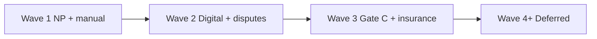

# Roadmap — Launch Waves (Phase 1.5 → 3)

**Project:** CryptoMarket P2P  
**Updated:** 2026-05-23  
**Status:** 100% planning documentation complete — implementation pending

---

## Overview

| Wave | Focus | Entry criteria | Exit criteria | User can do after launch |
|------|-------|----------------|---------------|--------------------------|
| **Wave 1** | Physical NP + manual TRC20/BEP20 | Contract approved + deliveryPolicy unlock accepted by AGENTS.md | [Wave 1 checklist](./IMPLEMENTATION-PLAN-PHASE-1.5.md#8-launch-checklist--honest-phase-15-beta) green | Buy physical goods, seller 24h confirm, pay manual, NP ship, dispute L1 basic |
| **Wave 2** | Digital files + dispute playbook | Wave 1 shipped | [Wave 2 checklist](./IMPLEMENTATION-PLAN-WAVE-2.md#7-launch-checklist--honest-wave-2) green | Buy digital files, auto-delivery, 24h inspection, L1/L2 disputes with SLA |
| **Wave 3** | Gate C ck* + insurance + high-value | Wave 2 shipped | [Wave 3 checklist](./IMPLEMENTATION-PLAN-WAVE-3.md#7-launch-checklist--honest-wave-3) green | Pay ckUSDC/ckUSDT trustless (capped), tiered high-value, capped insurance copy |
| **Wave 4+** | Deferred / out-of-scope | Product decision | TBD | Self-pickup, jury, external KYC, buyer stake, omnichain trustless |

---

## Wave 1 — Golden path (physical + manual)

**Plan:** [IMPLEMENTATION-PLAN-PHASE-1.5.md](./IMPLEMENTATION-PLAN-PHASE-1.5.md)

**Stories (order):**

1. E3.S8 → 2. E4.S7 → 3. E6.S8 → 4. E3.S7 → 5. E3.S10 → 6. E9.S2 → 7. E7.S3 → 8. E3.S9 → 9. E13.S1

**Honest promise:** Platform-coordinated manual settlement — **not** trustless escrow.

---

## Wave 2 — Digital + disputes

**Plan:** [IMPLEMENTATION-PLAN-WAVE-2.md](./IMPLEMENTATION-PLAN-WAVE-2.md)

**Stories (order):**

1. E2.S11 → 2. E7.S2-enhance → 3. E6.S9

**Depends on:** Wave 1 handshake, PaymentIntent, NP E2E.

**Honest promise:** Encrypted file delivery after payment; 24h inspection; no DRM; L1/L2 moderator disputes.

---

## Wave 3 — Trustless beta + insurance + caps

**Plan:** [IMPLEMENTATION-PLAN-WAVE-3.md](./IMPLEMENTATION-PLAN-WAVE-3.md)

**Stories (order):**

1. E9.S6 → 2. E9.S3 → 3. E10.S4 → 4. E6.S6-depth → 5. E6.S7-depth → 6. E3.S11 → 7. E4.S8

**Depends on:** Wave 1–2; security sign-off; P0 tests green.

**Honest promise:** ckUSDC/ckUSDT trustless (capped); capped insurance reserve **or** no guarantee copy; high-value tier gates.

---

## Wave 4+ — Explicit deferrals

| Story | Reason deferred | AC stub |
|-------|-----------------|---------|
| E7.S1 Self-pickup | Contract §7 — NP only | Wave 4+ meetup + evidence AC in manifest |
| E6.S4 Jury | Moderator playbook first (D-014) | Jury voting when volume justifies |
| E12.S2 External KYC | Admin manual tier sufficient beta | External provider integration Wave 4+ |
| Buyer stake | Reputation/velocity first (D-047) | Future epic |
| Omnichain trustless | Long-term E14 eval (D-049) | ADR hooks in E9.S4/S5 |

---

## Dependency between waves

**Hard rule:** Do not market Wave N promises until Wave N−1 checklist is green.

---

## Implementation readiness summary

| Wave | Planning Docs | Code | Implementation Handoff |
|------|----------|------|---------|
| Wave 1 | 🟢 complete | 🟢 complete | 🟢 shipped |
| Wave 2 | 🟢 complete | 🟢 complete | 🟢 shipped |
| Wave 3 | 🟢 complete | 🟢 complete | 🟡 beta launch checklist partial |
| Wave 4+ | 🟢 AC stubs | N/A | 🟡 documented defer |

See [gap-analysis.md §7](./gap-analysis.md) for story-level matrix.

---

## Navigation

| Document | Purpose |
|----------|---------|
| [INDEX.md](./INDEX.md) | Master navigation |
| [PHASE-1.5-LAUNCH-PROMISES.md](./PHASE-1.5-LAUNCH-PROMISES.md) | Honest vs dishonest promises |
| [DECISION-LOG.md](./DECISION-LOG.md) | Locked defaults D-001–D-049 |
| [TRADE-STATE-MACHINE.md](./TRADE-STATE-MACHINE.md) | States Wave 1–3 |
| [DOCUMENTATION-COMPLETENESS.md](./DOCUMENTATION-COMPLETENESS.md) | 100% coverage checklist |
