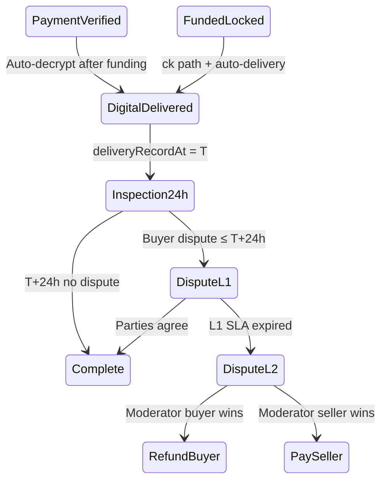
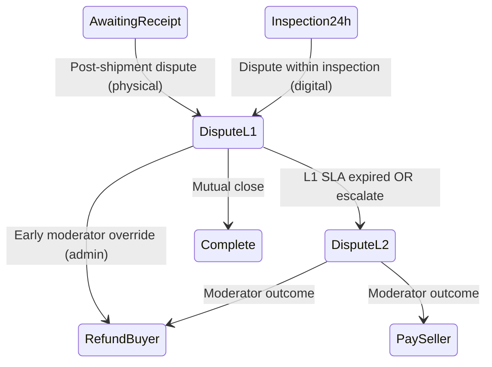
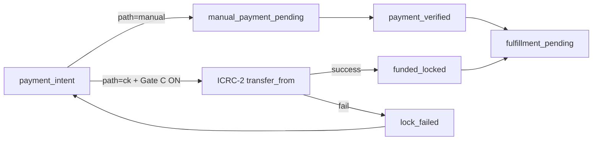

# Trade State Machine — CryptoMarket P2P Phase 1.5

**Версія:** 2026-05-23  
**Статус:** Специфікація для Wave 1–3 implementation  
**Джерела:** [USER-PRODUCT-CONTRACT.md](./USER-PRODUCT-CONTRACT.md), [COUNCIL-FINDINGS.md](./COUNCIL-FINDINGS.md), [IMPLEMENTATION-PLAN-PHASE-1.5.md](./IMPLEMENTATION-PLAN-PHASE-1.5.md), [IMPLEMENTATION-PLAN-WAVE-2.md](./IMPLEMENTATION-PLAN-WAVE-2.md), [IMPLEMENTATION-PLAN-WAVE-3.md](./IMPLEMENTATION-PLAN-WAVE-3.md)

---

## 1. Призначення

Цей документ — **технічна специфікація станів угоди** для backend (`Escrow.mo`, `escrow-api.mo`, `payments-api.mo`, `shipping-api.mo`) і frontend (`TradeDetailPage`, `EscrowTimeline`).

**Інваріант (P0):** жоден шлях не може дати подвійний terminal state, подвійну оплату, доставку до lock, виплату до fulfillment, або повторне використання stake при concurrent exposure.

---

## 2. Діаграма (Phase 1.5 — фізичний товар + manual payment)

```mermaid
stateDiagram-v2
  [*] --> AwaitingSellerHandshake: Buyer taps Buy (no funds locked)

  AwaitingSellerHandshake --> Cancelled100Buyer: Seller declines OR 24h timeout
  AwaitingSellerHandshake --> PaymentIntent: Seller confirms (≤24h)

  PaymentIntent --> LockFailed: ck* ICRC-2 fails (retryable)
  PaymentIntent --> ManualPaymentPending: TRC20/BEP20 instructions issued
  PaymentIntent --> FundedLocked: ck* transfer_from OK (Gate C only, Wave 3 enable)

  LockFailed --> PaymentIntent: Retry after fix
  ManualPaymentPending --> PaymentVerified: Explorer-verified tx (all fields match)
  ManualPaymentPending --> ManualPaymentPending: Wrong chain/token/amount rejected

  FundedLocked --> FulfillmentPending: Physical or digital path
  PaymentVerified --> FulfillmentPending

  FulfillmentPending --> BuyerCancel855: Buyer cancels BEFORE shipment/reveal
  FulfillmentPending --> Shipped: Valid NP TTN + carrier accepted
  FulfillmentPending --> DigitalDelivered: Digital only (Wave 2)

  Shipped --> AwaitingReceipt: NP in transit
  AwaitingReceipt --> Complete: Buyer confirms receipt
  AwaitingReceipt --> Complete: NP delivered/вручено + 48h no dispute
  AwaitingReceipt --> DisputeL1: Buyer opens dispute

  DigitalDelivered --> Inspection24h: Wave 2 — clock from delivery record
  Inspection24h --> Complete: Inspection pass OR window expired
  Inspection24h --> DisputeL1: Buyer disputes within window

  BuyerCancel855 --> Cancelled855: 85% buyer / 10% seller / 5% platform

  DisputeL1 --> DisputeL2: L1 SLA expired without resolution
  DisputeL1 --> Complete: Parties agree
  DisputeL1 --> RefundBuyer: Moderator L2 (buyer wins)
  DisputeL1 --> PaySeller: Moderator L2 (seller wins)

  DisputeL2 --> RefundBuyer
  DisputeL2 --> PaySeller

  Complete --> [*]: Payout seller minus fee; stake claim period
  Cancelled100Buyer --> [*]
  Cancelled855 --> [*]
  RefundBuyer --> [*]
  PaySeller --> [*]
```



---

## 3. Стани — визначення

| Стан (internal id) | User-facing (UA) | Кошти покупця | Stake продавця |
|------------------|------------------|---------------|----------------|
| `awaiting_seller_handshake` | Очікує підтвердження продавця | **Не заблоковані** | Reserved on listing (E6.S8) |
| `cancelled_no_seller_response` | Скасовано — продавець не відповів | N/A (100% refund promise) | Без penalty |
| `payment_intent` | Підтверджено — очікує оплату | Ще не verified | Reserved |
| `manual_payment_pending` | Очікує підтвердження переказу | Off-chain — explorer pending | Reserved |
| `funded_locked` | Кошти підтверджено (ck* only, Wave 3) | On-chain escrow | Reserved |
| `payment_verified` | Оплату підтверджено (manual) | Coordinated — not custodial | Reserved |
| `fulfillment_pending` | Готово до відправки | Locked/verified | Reserved |
| `shipped` | Відправлено (TTN) | Locked/verified | Reserved |
| `awaiting_receipt` | В дорозі / очікує отримання | Locked/verified | Reserved |
| `dispute_l1` | Спір — переговори | **Frozen** — no payout | Reserved + frozen |
| `dispute_l2` | Спір — модератор | **Frozen** | Reserved + frozen |
| `complete` | Завершено | Settled | Claim period then release |
| `cancelled_buyer_pre_ship` | Скасовано покупцем | 85/10/5 split | Partial to seller |
| `refunded` / `paid_seller` | Terminal dispute outcomes | Settled | Seizure if seller fault |

---

## 4. Таймери

| Таймер | Тривалість | Старт | Дія при expiry | Хто може скинути |
|--------|------------|-------|----------------|------------------|
| `sellerResponseDeadline` | **24 год** | Trade created (`Buy`) | Auto → `cancelled_no_seller_response`, buyer 100% | Seller confirm/decline (terminal) |
| `paymentIntentExpiry` | **72 год** (default) | Seller confirms | Auto-cancel payment intent, return to handshake or cancel | Verified payment |
| `shipByDeadline` | **7 днів** (beta default) | `payment_verified` / `funded_locked` | Escalation → dispute/refund path | Valid TTN → `shipped` |
| `npDeliveredGrace` | **48 год** | NP status `delivered`/`вручено` | Auto-complete if no dispute | Buyer confirm OR dispute |
| `digitalInspectionDeadline` | **24 год** | Delivery record timestamp (Wave 2) | Auto-complete if no dispute | Dispute within window |
| `stakeClaimPeriod` | **48 год** post-complete | `complete` | Release stake to seller | Liability/seizure event |

**Upgrade resilience:** усі deadlines зберігаються в stable storage; після canister upgrade job `resumeDeadlines` перереєстровує timers (P0 test).

---

## 5. Переходи — хто ініціює

| Перехід | Actor | Preconditions | Side effects |
|---------|-------|---------------|--------------|
| Create trade | Buyer | Listing active, stake OK, caps OK | State → `awaiting_seller_handshake`, start 24h timer |
| Seller confirm | Seller | Within 24h, trade in handshake | → `payment_intent`, snapshot payout wallet |
| Seller decline | Seller | Handshake state | → `cancelled_no_seller_response` |
| Timeout handshake | System | 24h elapsed | → `cancelled_no_seller_response`, no lock |
| Issue manual instructions | System | After `payment_intent` | → `manual_payment_pending`, exact amount/chain/address |
| Verify manual tx | System (explorer) | Hash matches intent | → `payment_verified` |
| Mark shipped | Seller | `payment_verified`, valid TTN | → `shipped` |
| Buyer confirm receipt | Buyer | Shipped or delivered | → `complete` |
| NP auto-complete | System | Delivered + 48h, no dispute | → `complete` |
| Buyer cancel pre-ship | Buyer | Funded, not shipped | → `cancelled_buyer_pre_ship`, 85/10/5 |
| Open dispute L1 | Either party | Post-shipment rules | → `dispute_l1`, freeze payout |
| Escalate L2 | Either party / system SLA | L1 timeout | → `dispute_l2` |
| Moderator resolve | Moderator | L2 active | → `refunded` or `paid_seller` |
| ICRC lock (Wave 3) | Buyer | Handshake OK, Gate C on | → `funded_locked` or `lock_failed` |

---

## 6. Fund freeze scope

| Стан | Buyer funds | Seller stake | Payout allowed |
|------|-------------|--------------|----------------|
| Handshake | Not locked | Listing reserve only | No |
| Payment intent / manual pending | Not platform-custodial (manual) | Reserved | No |
| Payment verified / funded | Coordinated obligation recorded | Reserved per trade | No |
| Shipped / awaiting receipt | Frozen obligation | Reserved | No |
| Dispute L1/L2 | Frozen | Frozen + seizure queue | **No** |
| Complete (claim period) | Settled | Held through claim window | Seller payout yes |
| Cancelled 100% | No deduction | No penalty | No |

**Manual chains:** платформа **не** custodial — freeze = account restrictions + recorded obligation + block payout flags, не seizure з гаманця покупця.

---

## 7. Error / timeout paths

| Подія | Fail-closed поведінка |
|-------|----------------------|
| NP API down | No auto-complete; no invalid TTN → shipped |
| Invalid TTN format | Reject `markShipped`; stay in `fulfillment_pending` |
| Explorer verify fail | Stay in `manual_payment_pending`; show retry |
| Wrong token/network/underpay | Reject verify; no `payment_verified` |
| ICRC lock fail (Gate C) | Roll back to `payment_intent`; seller must not ship |
| Payout wallet changed after lock | Reject or hold payout; alert fraud |
| Confirm vs timeout race | Deterministic winner; idempotent transitions |
| Upgrade mid-handshake | Resume `sellerResponseDeadline` from persisted timestamp |

---

## 8. Зв'язок зі stories

| Story | States / transitions owned |
|-------|------------------------------|
| E3.S7 | `awaiting_seller_handshake`, timeout, decline |
| E3.S8 | Fee display before create (pre-state) |
| E3.S10 | `payment_intent`, lock gates, block ship until funded |
| E3.S9 | `cancelled_buyer_pre_ship`, 85/10/5 math |
| E4.S7 | Payout wallet snapshot at `payment_intent` |
| E4.S2 | Explorer verify → `payment_verified` |
| E6.S8 | Stake reserve/seize across all non-terminal states |
| E7.S3 | TTN validation, `shipped`, NP delivered + 48h |
| E9.S2 | Gate C default false; ICRC path gated on handshake |
| E13.S1 | Race tests for all P0 paths above |
| E2.S11 | `digital_delivered`, fileVersionId, auto-delivery gate |
| E7.S2-enhance | `inspection24h`, `deliveryRecordAt`, redownload invariant |
| E6.S9 | `dispute_l1`, `dispute_l2`, freeze, SLA escalation |
| E9.S6 | `funded_locked` (Gate C), ck path enable |
| E9.S3 | On-chain release/refund terminal transitions |
| E10.S4 | Insurance reserve touchpoint on seller-fault waterfall |
| E6.S6/E6.S7 | Liability IDs, waterfall order manual vs ck |
| E3.S11 | High-value tier gates at trade create |

---

## 9. Digital goods branch (Wave 2)



### Digital-specific invariants

| Invariant | Enforcement |
|-----------|-------------|
| No key/URL before funding | Block download API until `payment_verified` or `funded_locked` |
| Immutable file version | `fileVersionId` + hash; no replace during active trades |
| Inspection clock | Starts at `deliveryRecordAt`, **not** first download |
| Redownload | Does **not** reset `digitalInspectionDeadline` |
| No DRM promise | Copy only; evidence-based disputes |

### Digital timers

| Timer | Value | Start |
|-------|-------|-------|
| `digitalInspectionDeadline` | 24h | `deliveryRecordAt` on auto-delivery |
| Dispute L1 (digital) | 6h | Dispute open (E6.S9) |

---

## 10. Dispute L1/L2 states (Wave 2)



| State | Freeze scope | Auto-complete |
|-------|--------------|---------------|
| `dispute_l1` | Payout blocked; stake reserved | **Paused** |
| `dispute_l2` | Same + moderator queue | **Paused** |

**SLA defaults (D-031, D-032):**

| Level | Physical L1 | Digital L1 | L2 triage | L2 decision |
|-------|---------------|------------|-----------|-------------|
| Duration | 24h | 6h | 4–12h | 24–72h |

**Evidence minimum:** TTN + photos (physical); file hash + download log (digital); trade chat thread reference.

---

## 11. Insurance / reserve touchpoints (Wave 3)

Insurance **не** змінює state machine напряму — впливає на **settlement waterfall** після terminal dispute або seller-fault:

```text
P (refund obligation)
→ seize stake S = max(5%×P, 10 USDT)
→ on-chain ck refund (if funded_locked)
→ insurance payout min(residual, 20% liquid fund, caps)
→ liability record + account block
```

| Touchpoint | When |
|------------|------|
| Fee accrual → reserve | Each completed trade (40% of platform fee) |
| Insurance payout request | Seller-fault L2 outcome with residual > 0 |
| Block high-value insurance | Trade > 500 USDT — stake-only |
| Zero fund copy | UI never shows full-refund guarantee |

States `refunded` / `paid_seller` trigger treasury movements per E10.S4 — not separate escrow states.

---

## 12. Gate C on-chain branch vs manual branch (Wave 3)



| Path | Custody | Marketing label | Beta cap |
|------|---------|-------------------|----------|
| Manual TRC20/BEP20 | Platform-coordinated, **not** custodial | «Координоване підтвердження» | 500 USDT (Wave 1) |
| Manual ERC20 USDT/USDC | Platform-coordinated, **not** custodial | «Координоване підтвердження» + gas warning | 500 USDT equivalent after Wave 3 E4.S8 |
| ckUSDC/ckUSDT (Gate C) | Canister ICRC escrow | «Trustless escrow» (ck only) | 500 USDT ck beta; >1000 ck-only tier |

**Mutual exclusion (D-016):** trade cannot be both `payment_verified` (manual) and `funded_locked` (ck).

**High-value (E3.S11):** >1000 USDT → ck-only; >5000 USDT → reject.

---

## 13. Legacy mapping (migration note)

| Legacy state | Target Phase 1.5 |
|--------------|------------------|
| `#pending` (immediate payable) | Split → `awaiting_seller_handshake` then `payment_intent` |
| `funded_locked` (doc id) | `#funded` (Motoko `TradeStatus`) — ck on-chain path only |
| `#funded` before handshake | **Forbidden** — reject on read/migrate |
| Seller release from `#funded` | Block until fulfillment rules met |

---

*Див. також Wave plans ([Phase 1.5](./IMPLEMENTATION-PLAN-PHASE-1.5.md), [Wave 2](./IMPLEMENTATION-PLAN-WAVE-2.md), [Wave 3](./IMPLEMENTATION-PLAN-WAVE-3.md)) та [DECISION-LOG.md](./DECISION-LOG.md).*
