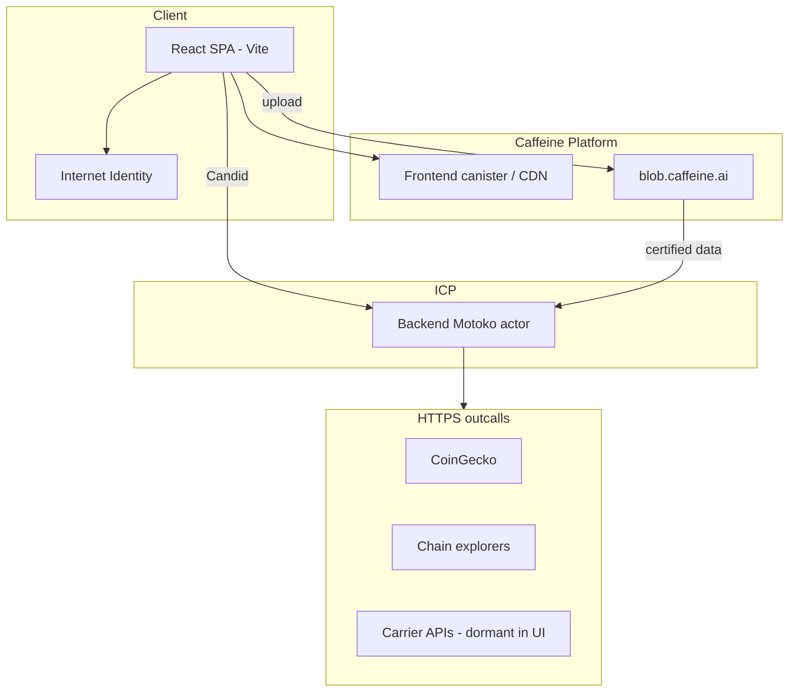

# Architecture — CryptoMarket P2P (Caffeine / ICP)

## 1. Introduction

Single source of truth for **how this repo is built today**. Supersedes legacy `crypto_market` multi-canister + Flutter architecture.

## 2. High-level view



## 3. Platform choices

| Decision | Choice | Rationale |
|----------|--------|-----------|
| Deployment | **Caffeine.ai** | Hosted ICP app lifecycle, drafts, live |
| Build | **mops** (not dfx.json in repo) | Motoko package + canister build |
| Backend shape | **Single persistent actor** | Simpler ops than 7-canister split |
| Frontend | **React 19 + TS + TanStack** | Caffeine template; web-first |
| Auth | **Internet Identity only** | Pseudonymous principal; no email/OAuth |
| Storage | **Caffeine object storage** | Listing photos; certified data hook |
| Config | **Runtime `env.json`** | `backend_canister_id`, II origin |

## 4. Backend structure

```
src/backend/
  main.mo          # Composed actor, shared maps
  types.mo         # Domain types
  lib/             # Pure logic (Escrow, Marketplace, …)
  mixins/*-api.mo  # Public Candid API
```

**Domains:** Auth, Marketplace, Escrow, Payments, Shipping, Messaging, Disputes, Reputation, Admin, Observability, Vault, Governance (latter two deferred in product).

**Persistence:** In-memory maps in actor body (orthogonal persistence pattern per AGENTS.md).

## 5. Frontend structure

```
src/frontend/src/
  pages/           # Route-level (Home, Listings, Trade, Admin, …)
  components/      # Feature + ui/
  contexts/        # Notifications, locale
  hooks/           # useAuth, useBackend
  lib/deliveryPolicy.ts  # Product lock: pickup-only
```

## 6. Trade settlement (critical)

### Phase 1 (implemented)

- Payment occurs **off-chain** (user wallets).
- Canister transitions: pending → buyer_confirmed → complete (via seller confirm).
- **No fund lock** in canister.

### Phase 2 (partial)

- `verifyPayment` via HTTPS outcalls to explorers.
- Oracle cache for USD reference.

### Phase 3 (planned)

- ICRC-1 transfers + threshold ECDSA escrow.
- HTLC only if explicitly re-approved in PRD.

## 7. Security architecture

- `assertNotAnonymous` on mutating endpoints.
- Rate limiter per sensitive endpoints.
- Reentrancy guard on escrow mutations.
- Chat message escaping (XSS).
- Shipping/payment external APIs **only from canister** (never from React).

## 8. Deferred / legacy-from-old-project

| Feature | Code | Product |
|---------|------|---------|
| Multi-canister split | No | N/A |
| Flutter client | No | N/A |
| Email/OAuth auth | No | N/A |
| Governance DAO | Partial | Off |
| Vault treasury UI | Partial | Off |
| UA carriers in UI | Backend yes | Locked (`deliveryPolicy.ts`) |
| Dual reputation scores | Partial | Single score in UI |

## 9. Deployment and environments

| Env | URL pattern | Notes |
|-----|-------------|-------|
| Live | `*.caffeine.xyz` (project-specific) | Draft v91+ at time of doc |
| Local | Vite dev + `mops` | II local origin |

**GitHub:** `Vatalion/cryptomarket-p2p-v2`  
**Caffeine project ID:** `019d6be7-8226-74ba-bbb3-9aca974e04f3`

## 10. Verification

- Motoko: `mops test`
- Live: `caf app smoke`, flow templates in caffeine-cli `.caf/projects/.../verification/`

## 11. Architecture decisions log

| ADR | Decision |
|-----|----------|
| ADR-001 | ICP + Caffeine, not self-managed dfx pipeline |
| ADR-002 | Single actor monolith vs multi-canister |
| ADR-003 | II-only auth |
| ADR-004 | Stablecoin-only; 4 active tokens in Phase 1 |
| ADR-005 | Phase 1 honest manual settlement before trustless marketing |
| ADR-006 | Physical fulfillment locked to self-pickup until carrier QA |
